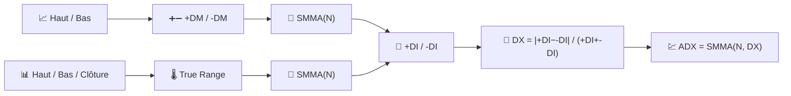

# 💹 ADX — Indice Directionnel Moyen

L'ADX répond à une question qu'aucune moyenne mobile ne peut poser : *« y a-t-il même une tendance qui mérite d'être suivie ? »* Il mesure la **force** d'un mouvement directionnel, en ignorant délibérément sa direction.

---

## 💡 Signification financière

Les traders associent souvent l'ADX à un système de suivi de tendance (croisements de moyennes mobiles, cassures) comme filtre : ne prendre que les signaux de tendance lorsque l'ADX dépasse un seuil (généralement 25) et rester à l'écart lorsqu'il est bas — signe d'un marché en range, sujet aux à-coups, où les suiveurs de tendance sont pris dans des retournements brutaux. Les deux lignes compagnes, **+DI** et **-DI**, indiquent *quelle* direction domine actuellement.

---

## 🔢 Formules mathématiques

1. **Mouvement directionnel** — le plus grand des mouvements à la hausse ou à la baisse dans le haut/bas, en ne conservant que le dominant :

    $$
    +DM_t = \max(H_t - H_{t-1},\, 0) \quad \text{si} \quad H_t - H_{t-1} > L_{t-1} - L_t, \text{ sinon } 0
    $$

    $$
    -DM_t = \max(L_{t-1} - L_t,\, 0) \quad \text{si} \quad L_{t-1} - L_t > H_t - H_{t-1}, \text{ sinon } 0
    $$

2. **True Range** $TR_t$ (voir [ATR](atr.md)), lissé sur $N$ périodes, normalise les mouvements directionnels en **+DI** / **-DI** :

    $$
    +DI_t = 100 \cdot \frac{SMMA_N(+DM)}{SMMA_N(TR)}, \qquad
    -DI_t = 100 \cdot \frac{SMMA_N(-DM)}{SMMA_N(TR)}
    $$

3. **Indice directionnel** et son propre lissage donnent l'**ADX** :

    $$
    DX_t = 100 \cdot \frac{\left| +DI_t - -DI_t \right|}{+DI_t + -DI_t}, \qquad
    ADX_t = SMMA_N(DX)
    $$

---

## ⚙️ Paramètres

| Paramètre | Clé | Défaut | Description |
|---|---|---|---|
| Période ($N$) | `period` | 14 | Fenêtre de lissage pour +DM, -DM, TR et DX. |

---

## 🎛️ Équivalent en traitement du signal — Enveloppe de dérivée rectifiée et normalisée

+DM et -DM sont des **dérivées à redressement demi-onde** des séries haut/bas — conceptuellement la même astuce que le RSI applique à la clôture. Les lignes DI normalisent chaque dérivée rectifiée par le True Range (l'amplitude locale du signal), les rendant invariantes à l'échelle. L'ADX prend ensuite la **différence absolue normalisée** de deux enveloppes et la lisse — mesurant effectivement à quel point l'« énergie directionnelle » est loin d'être également répartie entre la hausse et la baisse.

!!! warning "L'ADX n'est pas directionnel"

    Un ADX en hausse avec `+DI` au-dessus de `-DI` confirme une **tendance haussière** ; un ADX en hausse avec
    `-DI` au-dessus de `+DI` confirme une **tendance baissière**. L'ADX seul, sans vérifier quelle ligne DI
    est au-dessus, vous indique seulement qu'une tendance existe — jamais dans quelle direction elle pointe.

:material-link: [Average Directional Index on Wikipedia](https://en.wikipedia.org/wiki/Average_directional_movement_index){ target="_blank" }
