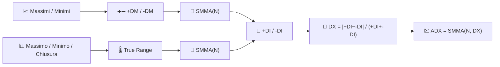

# 💹 ADX — Indice Direzionale Medio

L'ADX risponde a una domanda a cui nessuna media mobile può rispondere: *"esiste davvero un trend che valga la pena seguire?"* Misura la **forza** di un movimento direzionale, ignorando deliberatamente la sua direzione.

---

## 💡 Significato Finanziario

I trader spesso abbinano l'ADX a un sistema di trend-following (incroci di medie mobili, breakout) come filtro: prendono segnali di trend solo quando l'ADX sale sopra una soglia (comunemente 25) e si astengono quando è basso — segno di un mercato laterale e volatile dove i trend-followers subiscono falsi segnali. Le due linee compagne, **+DI** e **-DI**, mostrano *quale* direzione domina attualmente.

---

## 🔢 Formule Matematiche

1. **Movimento Direzionale** — il maggiore tra il movimento al rialzo o al ribasso nel massimo/minimo, mantenendo solo quello dominante:

    $$
    +DM_t = \max(H_t - H_{t-1},\, 0) \quad \text{se} \quad H_t - H_{t-1} > L_{t-1} - L_t, \text{ altrimenti } 0
    $$

    $$
    -DM_t = \max(L_{t-1} - L_t,\, 0) \quad \text{se} \quad L_{t-1} - L_t > H_t - H_{t-1}, \text{ altrimenti } 0
    $$

2. **True Range** $TR_t$ (vedi [ATR](atr.md)), lisciata su $N$ periodi, normalizza i movimenti direzionali in **+DI** / **-DI**:

    $$
    +DI_t = 100 \cdot \frac{SMMA_N(+DM)}{SMMA_N(TR)}, \qquad
    -DI_t = 100 \cdot \frac{SMMA_N(-DM)}{SMMA_N(TR)}
    $$

3. **Indice Direzionale** e la sua stessa smussatura dà l'**ADX**:

    $$
    DX_t = 100 \cdot \frac{\left| +DI_t - -DI_t \right|}{+DI_t + -DI_t}, \qquad
    ADX_t = SMMA_N(DX)
    $$

---

## ⚙️ Parametri

| Parametro | Chiave | Default | Descrizione |
|---|---|---|---|
| Periodo ($N$) | `period` | 14 | Finestra di lisciatura per +DM, -DM, TR e DX. |

---

## 🎛️ Equivalente in Elaborazione dei Segnali — Inviluppo Derivativo Rettificato e Normalizzato

+DM e -DM sono **derivate raddrizzate a semionda** della serie dei massimi/minimi — concettualmente lo stesso trucco che l'RSI applica alla chiusura. Le linee DI normalizzano ciascuna derivata raddrizzata per il True Range (l'ampiezza locale del segnale), rendendole invarianti di scala. L'ADX quindi prende la **differenza assoluta normalizzata** di due inviluppi e la smussa — misurando efficacemente quanto l'"energia direzionale" è lontana dall'essere equamente divisa tra rialzo e ribasso.

!!! warning "L'ADX non indica la direzione"

    Un ADX in aumento con `+DI` sopra `-DI` conferma un **trend rialzista**; un ADX
    in aumento con `-DI` sopra `+DI` conferma un **trend ribassista**. L'ADX da solo,
    senza verificare quale linea DI è in alto, indica solo l'esistenza di un trend —
    mai la sua direzione.

:material-link: [Average Directional Index su Wikipedia](https://en.wikipedia.org/wiki/Average_directional_movement_index){ target="_blank" }
