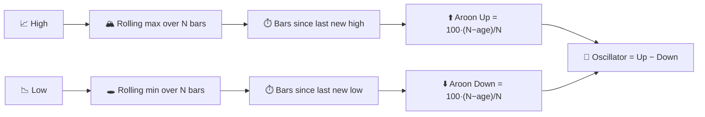

# ⏱️ Aroon — Time-Since-Extreme Indicator

Aroon measures **when**, not how much: how many periods have elapsed since the highest high and the lowest low within a lookback window. A fresh new trend shows up as "time since extreme" collapsing toward zero.

---

## 💡 Financial Meaning

Aroon Up spikes to 100 the moment price sets a new $N$-period high; it decays linearly if no new high appears. The same logic, mirrored, drives Aroon Down from the lowest low. A crossover of Aroon Up above Aroon Down — especially near 100 — signals the *birth* of an uptrend; the reverse signals a new downtrend. The **Aroon Oscillator** (Up − Down) condenses both lines into one, oscillating between −100 and +100.

---

## 🔢 Mathematical Formulas

1.  **Periods since the highest high / lowest low** within the last $N$ observations:

    $$
    p^{H}_t = \operatorname*{argmax}_{0 \le i \le N} H_{t-i}, \qquad
    p^{L}_t = \operatorname*{argmax}_{0 \le i \le N} \big(-L_{t-i}\big)
    $$

2.  **Aroon Up / Down**, rescaling elapsed time into a 0–100 "freshness" score:

    $$
    Up_t = 100 \cdot \frac{N - p^{H}_t}{N}, \qquad
    Down_t = 100 \cdot \frac{N - p^{L}_t}{N}
    $$

3.  **Aroon Oscillator**:

    $$
    Osc_t = Up_t - Down_t
    $$

---

## ⚙️ Parameters

| Parameter | Key | Default | Description |
|---|---|---|---|
| Period ($N$) | `period` | 14 | Lookback window for locating the extreme high/low. |

---

## 🎛️ Signal Processing Equivalent — Peak-Hold Timer / Age Counter

Aroon is unusual among these indicators: it is not a filter on *amplitude* at all, but a **peak-hold circuit with an age counter**. Each new sample resets a "time-since-last-peak" register to zero if it beats the running maximum within the window; otherwise the register counts up. This is the discrete-time equivalent of a **retriggerable monostable timer** driven by a comparator against a sliding-window maximum/minimum.

!!! info "Complementary to ADX"

    ADX measures directional *energy accumulated* over the window; Aroon measures
    *elapsed time since* the last extreme. A trend can be strong by ADX's measure
    while Aroon shows it is "aging" (no new extreme for a while) — a common early
    warning of exhaustion that ADX alone will not show.

:material-link: [Aroon indicator on Wikipedia](https://en.wikipedia.org/wiki/Aroon_indicator){ target="_blank" }
