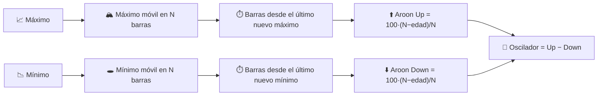

# ⏱️ Aroon — Indicador de Tiempo Desde el Extremo

Aroon mide **cuándo**, no cuánto: cuántos períodos han transcurrido desde el máximo más alto y el mínimo más bajo dentro de una ventana obsoleta. Una tendencia nueva se manifiesta como "tiempo desde el extremo" colapsando hacia cero.

---

## 💡 Significado Financiero

Aroon Up sube a 100 en el momento en que el precio establece un nuevo máximo de $N$ períodos; decae linealmente si no aparece un nuevo máximo. La misma lógica, reflejada, impulsa a Aroon Down desde el mínimo más bajo. Un cruce de Aroon Up por encima de Aroon Down — especialmente cerca de 100 — señala el *nacimiento* de una tendencia alcista; el inverso señala una nueva tendencia bajista. El **Oscilador Aroon** (Up − Down) condensa ambas líneas en una, oscilando entre −100 y +100.

---

## 🔢 Fórmulas Matemáticas

1. **Períodos desde el máximo más alto / mínimo más bajo** dentro de las últimas $N$ observaciones:

    $$
    p^{H}_t = \operatorname*{argmax}_{0 \le i \le N} H_{t-i}, \qquad
    p^{L}_t = \operatorname*{argmax}_{0 \le i \le N} \big(-L_{t-i}\big)
    $$

2. **Aroon Up / Down**, reescalando el tiempo transcurrido en una puntuación de "frescura" de 0 a 100:

    $$
    Up_t = 100 \cdot \frac{N - p^{H}_t}{N}, \qquad
    Down_t = 100 \cdot \frac{N - p^{L}_t}{N}
    $$

3. **Oscilador Aroon**:

    $$
    Osc_t = Up_t - Down_t
    $$

---

## ⚙️ Parámetros

| Parámetro | Clave | Valor por Defecto | Descripción |
|---|---|---|---|
| Período ($N$) | `period` | 14 | Ventana obsoleta para localizar el máximo/mínimo extremo. |

---

## 🎛️ Equivalente de Procesamiento de Señales — Temporizador de Retención de Pico / Contador de Edad

Aroon es inusual entre estos indicadores: no es un filtro sobre la *amplitud* en absoluto, sino un **circuito de retención de pico con un contador de edad**. Cada nueva muestra restablece un registro de "tiempo desde el último pico" a cero si supera el máximo actual dentro de la ventana; de lo contrario, el registro cuenta hacia arriba. Este es el equivalente en tiempo discreto de un **temporizador monostable re-disparable** impulsado por un comparador contra un máximo/mínimo de ventana deslizante.

!!! info "Complementario del ADX"

    El ADX mide la *energía direccional acumulada* durante la ventana; Aroon mide
    *el tiempo transcurrido desde* el último extremo. Una tendencia puede ser fuerte según la medida del ADX
    mientras que Aroon muestra que está "envejeciendo" (sin nuevo extremo por un tiempo) — una alerta temprana común
    de agotamiento que el ADX por sí solo no mostrará.

:material-link: [Indicador Aroon en Wikipedia](https://en.wikipedia.org/wiki/Aroon_indicator){ target="_blank" }
