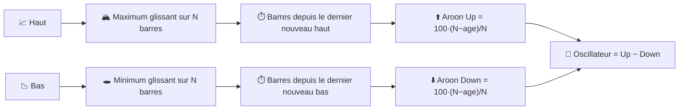

# ⏱️ Aroon — Indicateur du Temps Écoulé Depuis un Extrême

Aroon mesure **quand**, pas combien : combien de périodes se sont écoulées depuis le plus haut et le plus bas au sein d'une fenêtre d'observation. Une tendance nouvelle et fraîche se manifeste par un « temps écoulé depuis l'extrême » qui s'effondre vers zéro.

---

## 💡 Signification Financière

Aroon Up monte à 100 dès que le prix établit un nouveau plus haut sur $N$ périodes ; il décroît linéairement si aucun nouveau plus haut n'apparaît. La même logique, en miroir, anime Aroon Down à partir du plus bas. Un croisement d'Aroon Up au-dessus d'Aroon Down — surtout près de 100 — signale la *naissance* d'une tendance haussière ; l'inverse signale une nouvelle tendance baissière. L'**Oscillateur Aroon** (Up − Down) condense les deux lignes en une seule, oscillant entre −100 et +100.

---

## 🔢 Formules Mathématiques

1. **Périodes depuis le plus haut / plus bas** au sein des $N$ dernières observations :

    $$
    p^{H}_t = \operatorname*{argmax}_{0 \le i \le N} H_{t-i}, \qquad
    p^{L}_t = \operatorname*{argmax}_{0 \le i \le N} \big(-L_{t-i}\big)
    $$

2. **Aroon Up / Down**, remettant à l'échelle le temps écoulé en un score de « fraîcheur » de 0 à 100 :

    $$
    Up_t = 100 \cdot \frac{N - p^{H}_t}{N}, \qquad
    Down_t = 100 \cdot \frac{N - p^{L}_t}{N}
    $$

3. **Oscillateur Aroon** :

    $$
    Osc_t = Up_t - Down_t
    $$

---

## ⚙️ Paramètres

| Paramètre | Clé | Défaut | Description |
|---|---|---|---|
| Période ($N$) | `period` | 14 | Fenêtre d'observation pour localiser le plus haut/plus bas extrême. |

---

## 🎛️ Équivalent en Traitement du Signal — Temporisateur de Maintien de Crête / Compteur d'Âge

Aroon est inhabituel parmi ces indicateurs : ce n'est pas du tout un filtre sur l'*amplitude*, mais un **circuit de maintien de crête avec un compteur d'âge**. Chaque nouvel échantillon remet à zéro un registre de « temps écoulé depuis le dernier pic » s'il bat le maximum courant dans la fenêtre ; sinon, le registre compte. C'est l'équivalent en temps discret d'un **temporisateur monostable redéclenchable** piloté par un comparateur par rapport à un maximum/minimum sur fenêtre glissante.

!!! info "Complémentaire à l'ADX"

    L'ADX mesure l'*énergie directionnelle accumulée* sur la fenêtre ; Aroon mesure
    *le temps écoulé depuis* le dernier extrême. Une tendance peut être forte selon
    la mesure de l'ADX alors qu'Aroon montre qu'elle « vieillit » (aucun nouvel extrême
    depuis un moment) — un avertissement précoce courant d'épuisement que l'ADX seul
    ne montrera pas.

:material-link: [Indicateur Aroon sur Wikipédia](https://en.wikipedia.org/wiki/Aroon_indicator){: target="_blank" }
