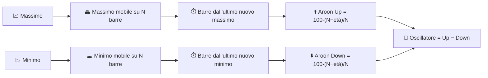

# ⏱️ Aroon — Indicatore di Tempo Trascorso dall'Estremo

Aroon misura **quando**, non quanto: quanti periodi sono trascorsi dal massimo più alto e dal minimo più basso all'interno di una finestra di osservazione. Un trend appena formato si manifesta quando il "tempo trascorso dall'estremo" collassa verso lo zero.

---

## 💡 Significato Finanziario

Aroon Up sale a 100 nel momento in cui il prezzo stabilisce un nuovo massimo su $N$ periodi; decade linearmente se non compare alcun nuovo massimo. La stessa logica, rispecchiata, guida Aroon Down partendo dal minimo più basso. Un incrocio di Aroon Up al di sopra di Aroon Down — specialmente vicino a 100 — segnala la *nascita* di un trend rialzista; il contrario segnala un nuovo trend ribassista. L'**Oscillatore Aroon** (Up − Down) condensa entrambe le linee in una sola, oscillando tra −100 e +100.

---

## 🔢 Formule Matematiche

1. **Periodi trascorsi dal massimo più alto / minimo più basso** all'interno delle ultime $N$ osservazioni:

    $$
    p^{H}_t = \operatorname*{argmax}_{0 \le i \le N} H_{t-i}, \qquad
    p^{L}_t = \operatorname*{argmax}_{0 \le i \le N} \big(-L_{t-i}\big)
    $$

2. **Aroon Up / Down**, che riconvertono il tempo trascorso in un punteggio di "freschezza" da 0 a 100:

    $$
    Up_t = 100 \cdot \frac{N - p^{H}_t}{N}, \qquad
    Down_t = 100 \cdot \frac{N - p^{L}_t}{N}
    $$

3. **Oscillatore Aroon**:

    $$
    Osc_t = Up_t - Down_t
    $$

---

## ⚙️ Parametri

| Parametro | Chiave | Predefinito | Descrizione |
|---|---|---|---|
| Periodo ($N$) | `period` | 14 | Finestra di osservazione per individuare il massimo/minimo estremo. |

---

## 🎛️ Equivalente nell'Elaborazione dei Segnali — Timer di Mantenimento del Picco / Contatore di Età

Aroon è insolito tra questi indicatori: non è affatto un filtro sull'*ampiezza*, ma un **circuito di mantenimento del picco con un contatore di età**. Ogni nuovo campione azzera un registro "tempo-trascorso-dall'ultimo-picco" se supera il massimo corrente all'interno della finestra; altrimenti il registro incrementa. Questo è l'equivalente a tempo discreto di un **timer monostabile riattivabile** pilotato da un comparatore rispetto a un massimo/minimo su finestra mobile.

!!! info "Complementare all'ADX"

    L'ADX misura l'*energia direzionale accumulata* durante la finestra; Aroon misura
    *il tempo trascorso dall'*ultimo estremo. Un trend può essere forte secondo la misura dell'ADX
    mentre Aroon mostra che sta "invecchiando" (nessun nuovo estremo da qualche tempo) — un comune avviso
    anticipato di esaurimento che l'ADX da solo non mostrerà.

:material-link: [Indicatore Aroon su Wikipedia](https://en.wikipedia.org/wiki/Aroon_indicator){ target="_blank" }
