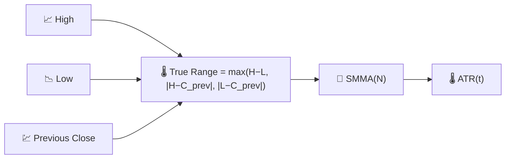

# 🌡️ ATR — Average True Range

ATR measures **how much an asset typically moves** in a single period, in absolute price units, independent of direction. It is the workhorse volatility measure behind most stop-loss and position-sizing rules.

---

## 💡 Financial Meaning

A simple high-minus-low range ignores overnight or gap moves; ATR fixes this by using the **True Range**, which also accounts for gaps relative to the previous close. Traders place stops at a multiple of ATR (e.g. "2×ATR below entry") so that the stop automatically widens in volatile conditions and tightens in calm ones, rather than using a fixed price distance that is too tight in fast markets and too loose in quiet ones.

---

## 🔢 Mathematical Formulas

1.  **True Range** — the largest of three candidates, capturing gaps as well as the intraday range:

    $$
    TR_t = \max\big(H_t - L_t,\; \left| H_t - C_{t-1} \right|,\; \left| L_t - C_{t-1} \right|\big)
    $$

2.  **Average True Range** — a smoothed moving average (Wilder's SMMA) of the True Range:

    $$
    ATR_t = SMMA_N(TR)
    $$

---

## ⚙️ Parameters

| Parameter | Key | Default | Description |
|---|---|---|---|
| Period ($N$) | `period` | 14 | Smoothing window applied to the True Range. |

---

## 🎛️ Signal Processing Equivalent — Smoothed Rectified Envelope

Taking $\max(\cdot)$ of three absolute-difference candidates is a form of **full-wave rectification with gap compensation** — it converts a signed, direction-agnostic quantity (price range) into a strictly positive "energy" measure. Smoothing that rectified signal with an SMMA (a one-pole IIR low-pass, same structure as the EMA) produces a running **envelope estimate**, conceptually the same role an envelope detector plays in an AM radio demodulator.

!!! tip "ATR has no upper bound"

    Because ATR is expressed in price units, its scale grows with the instrument's
    price level over time. When comparing volatility across different assets — or
    the same asset at very different price levels — use [NATR](natr.md) instead.

:material-link: [Average True Range on Wikipedia](https://en.wikipedia.org/wiki/Average_true_range){ target="_blank" }
