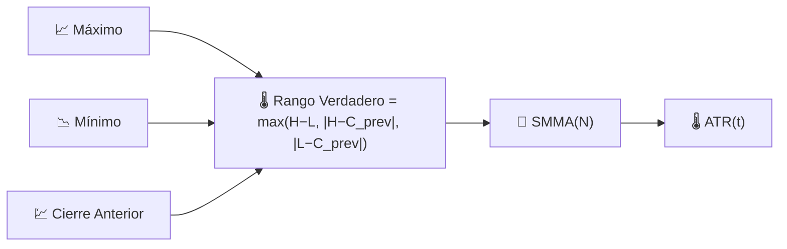

# 🌡️ ATR — Rango Verdadero Promedio

El ATR mide **cuánto se mueve típicamente un activo** en un solo período, en unidades de precio absolutas, independientemente de la dirección. Es la medida de volatilidad fundamental detrás de la mayoría de las reglas de stop-loss y dimensionamiento de posiciones.

---

## 💡 Significado Financiero

Un simple rango máximo-mínimo ignora los movimientos nocturnos o de gaps; el ATR soluciona esto utilizando el **Rango Verdadero** (True Range), que también contabiliza los gaps relativos al cierre anterior. Los traders colocan stops a un múltiplo del ATR (por ejemplo, "2×ATR por debajo de la entrada") para que el stop se amplíe automáticamente en condiciones volátiles y se ajuste en condiciones tranquilas, en lugar de usar una distancia de precio fija que es demasiado ajustada en mercados rápidos y demasiado holgada en mercados lentos.

---

## 🔢 Fórmulas Matemáticas

1. **Rango Verdadero** (True Range) — el mayor de tres candidatos, que captura los gaps así como el rango intradiario:

    $$
    TR_t = \max\big(H_t - L_t,\; \left| H_t - C_{t-1} \right|,\; \left| L_t - C_{t-1} \right|\big)
    $$

2. **Rango Verdadero Promedio** (Average True Range) — una media móvil suavizada (SMMA de Wilder) del Rango Verdadero:

    $$
    ATR_t = SMMA_N(TR)
    $$

---

## ⚙️ Parámetros

| Parámetro | Clave | Valor por defecto | Descripción |
|---|---|---|---|
| Período ($N$) | `period` | 14 | Ventana de suavizado aplicada al Rango Verdadero. |

---

## 🎛️ Equivalente de Procesamiento de Señales — Envolvente Rectificada Suavizada

Tomar $\max(\cdot)$ de tres candidatos de diferencia absoluta es una forma de **rectificación de onda completa con compensación de brechas** — convierte una cantidad con signo e independiente de la dirección (rango de precio) en una medida de "energía" estrictamente positiva. Suavizar esa señal rectificada con un SMMA (un filtro pasa bajos IIR de un polo, misma estructura que el EMA) produce una **estimación de envolvente** continua, conceptualmente el mismo papel que desempeña un detector de envolvente en un demodulador de radio AM.

!!! tip "El ATR no tiene límite superior"

    Debido a que el ATR se expresa en unidades de precio, su escala crece con el
    nivel de precio del instrumento a lo largo del tiempo. Al comparar la volatilidad
    entre diferentes activos — o el mismo activo a niveles de precio muy diferentes —
    utilice [NATR](natr.md) en su lugar.

:material-link: [Rango Verdadero Promedio en Wikipedia](https://en.wikipedia.org/wiki/Average_true_range){ target="_blank" }
