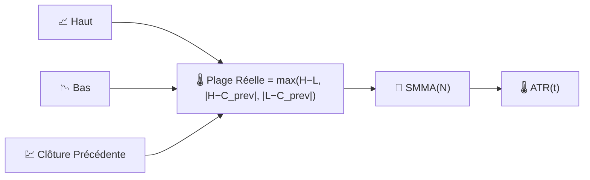

# 🌡️ ATR — Average True Range (Moyenne de la Plage Réelle)

L'ATR mesure **l'amplitude typique des mouvements d'un actif** sur une période donnée, en unités de prix absolues, indépendamment de la direction. C'est la mesure de volatilité de référence utilisée par la plupart des règles de stop-loss et de dimensionnement des positions.

---

## 💡 Signification Financière

Un simple calcul haut-moins-bas ignore les mouvements de nuit ou les gaps ; l'ATR corrige cela en utilisant la **Plage Réelle (True Range)**, qui tient également compte des gaps par rapport à la clôture précédente. Les traders placent leurs stops à un multiple de l'ATR (par exemple "2×ATR en dessous du point d'entrée") afin que le stop s'élargisse automatiquement en conditions volatiles et se resserre en conditions calmes, plutôt que d'utiliser une distance de prix fixe qui serait trop serrée dans les marchés rapides et trop lâche dans les marchés calmes.

---

## 🔢 Formules Mathématiques

1. **Plage Réelle (True Range)** — la plus grande des trois valeurs candidates, capturant les gaps ainsi que la plage intrajournalière :

    $$
    TR_t = \max\big(H_t - L_t,\; \left| H_t - C_{t-1} \right|,\; \left| L_t - C_{t-1} \right|\big)
    $$

2. **Average True Range (Moyenne de la Plage Réelle)** — une moyenne mobile lissée (SMMA de Wilder) de la Plage Réelle :

    $$
    ATR_t = SMMA_N(TR)
    $$

---

## ⚙️ Paramètres

| Paramètre | Clé | Défaut | Description |
|---|---|---|---|
| Période ($N$) | `period` | 14 | Fenêtre de lissage appliquée à la Plage Réelle. |

---

## 🎛️ Équivalent en Traitement du Signal — Enveloppe Rectifiée Lissée

Prendre le $\max(\cdot)$ de trois candidats de différence absolue est une forme de **redressement double alternance avec compensation de gap** — cela convertit une quantité signée et indépendante de la direction (la plage de prix) en une mesure d'"énergie" strictement positive. Le lissage de ce signal redressé avec un SMMA (un filtre passe-bas IIR à un pôle, de même structure que l'EMA) produit une **estimation d'enveloppe** courante, jouant conceptuellement le même rôle qu'un détecteur d'enveloppe dans un démodulateur radio AM.

!!! tip "L'ATR n'a pas de limite supérieure"

    Parce que l'ATR est exprimé en unités de prix, son échelle augmente avec le
    niveau de prix de l'instrument au fil du temps. Lorsque vous comparez la volatilité
    entre différents actifs — ou le même actif à des niveaux de prix très différents — 
    utilisez [NATR](natr.md) à la place.

:material-link: [Average True Range sur Wikipedia](https://en.wikipedia.org/wiki/Average_true_range){ target="_blank" }
