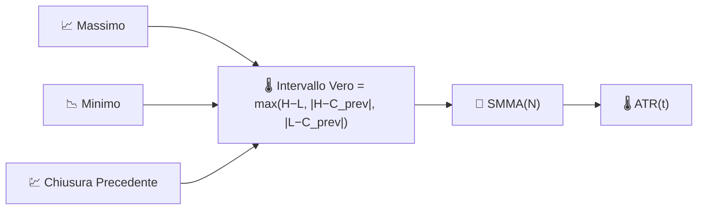

# 🌡️ ATR — Intervallo Medio Vero

L'ATR misura **quanto un asset si muove tipicamente** in un singolo periodo, in unità di prezzo assolute, indipendentemente dalla direzione. È la misura di volatilità alla base della maggior parte delle regole di stop-loss e dimensionamento delle posizioni.

---

## 💡 Significato Finanziario

Un semplice intervallo massimo-meno-minimo ignora i movimenti overnight o i gap; l'ATR risolve questo utilizzando l'**Intervallo Vero**, che tiene conto anche dei gap rispetto alla chiusura precedente. I trader posizionano gli stop a un multiplo dell'ATR (ad esempio "2×ATR sotto l'ingresso") in modo che lo stop si allarghi automaticamente in condizioni volatili e si restringa in quelle calme, invece di utilizzare una distanza di prezzo fissa che è troppo stretta in mercati veloci e troppo larga in quelli tranquilli.

---

## 🔢 Formule Matematiche

1. **Intervallo Vero** — il più grande di tre candidati, che cattura i gap oltre all'intervallo intraday:

    $$
    TR_t = \max\big(H_t - L_t,\; \left| H_t - C_{t-1} \right|,\; \left| L_t - C_{t-1} \right|\big)
    $$

2. **Intervallo Medio Vero** — una media mobile smussata (SMMA di Wilder) dell'Intervallo Vero:

    $$
    ATR_t = SMMA_N(TR)
    $$

---

## ⚙️ Parametri

| Parametro | Chiave | Default | Descrizione |
|---|---|---|---|
| Periodo ($N$) | `period` | 14 | Finestra di smoothing applicata all'Intervallo Vero. |

---

## 🎛️ Equivalente nell'Elaborazione dei Segnali — Inviluppo Rettificato Smussato

Prendere il $\max(\cdot)$ di tre candidati di differenza assoluta è una forma di **rettifica a onda intera con compensazione del gap** — converte una quantità con segno e senza direzione (intervallo di prezzo) in una misura di "energia" strettamente positiva. Smussare quel segnale rettificato con un SMMA (un filtro passa-basso IIR a un polo, stessa struttura dell'EMA) produce una **stima di inviluppo** in esecuzione, concettualmente lo stesso ruolo che un rilevatore di inviluppo svolge in un demodulatore radio AM.

!!! tip "ATR non ha un limite superiore"

    Poiché l'ATR è espresso in unità di prezzo, la sua scala cresce con il livello di prezzo dello strumento nel tempo. Quando si confronta la volatilità tra diversi asset — o lo stesso asset a livelli di prezzo molto diversi — utilizzare invece [NATR](natr.md).

:material-link: [Intervallo Medio Vero su Wikipedia](https://en.wikipedia.org/wiki/Average_true_range){ target="_blank" }
