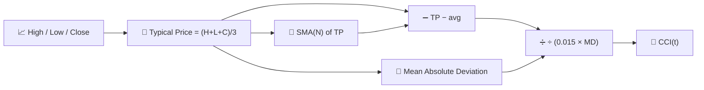

# 🔄 CCI — Commodity Channel Index

CCI measures how far the current "typical price" has strayed from its own recent average, expressed in units of **mean absolute deviation** rather than standard deviation. Despite the name, it is used across every asset class, not just commodities.

---

## 💡 Financial Meaning

CCI was designed to flag the start of new cycles: readings beyond +100 suggest price is unusually strong relative to its own recent typical range, while readings below −100 suggest unusual weakness. Unlike RSI, CCI is **unbounded** — it can push far past ±100 during strong trends, so extreme readings should be read as "strength" rather than an automatic reversal signal.

---

## 🔢 Mathematical Formulas

1.  **Typical Price** for each bar:

    $$
    TP_t = \frac{H_t + L_t + C_t}{3}
    $$

2.  **Simple moving average** of the typical price, and its **mean absolute deviation**:

    $$
    \overline{TP}_t = SMA_N(TP), \qquad
    MD_t = \frac{1}{N}\sum_{i=0}^{N-1} \left| TP_{t-i} - \overline{TP}_t \right|
    $$

3.  **CCI**, scaled by the conventional constant $0.015$ so that roughly 70–80% of values fall inside $\pm 100$:

    $$
    CCI_t = \frac{TP_t - \overline{TP}_t}{0.015 \cdot MD_t}
    $$

---

## ⚙️ Parameters

| Parameter | Key | Default | Description |
|---|---|---|---|
| Period ($N$) | `period` | 14 | Window for the typical-price average and mean deviation. |

---

## 🎛️ Signal Processing Equivalent — Deviation Normalised by Mean Absolute Error

CCI is structurally similar to a Bollinger Band $z$-score, but it normalises by **mean absolute deviation (MAD)** instead of standard deviation. MAD is a more *robust* (less outlier-sensitive) estimate of dispersion than $\sigma$, which is why CCI tends to react less violently to single extreme bars than a Bollinger-style normalisation would.

!!! note "±100 is a convention, not a law"

    The constant $0.015$ was chosen by Donald Lambert so that, empirically, 70–80% of
    CCI values land between −100 and +100 for typical instruments. It is a heuristic
    calibration, not a statistical guarantee — unlike RSI's mathematically fixed
    0–100 bound.

:material-link: [Commodity Channel Index on Wikipedia](https://en.wikipedia.org/wiki/Commodity_channel_index){ target="_blank" }
