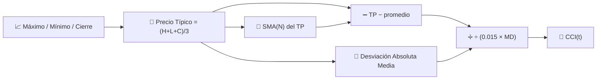

# 🔄 CCI — Índice del Canal de Materias Primas

El CCI mide qué tan lejos se ha desviado el "precio típico" actual de su propio promedio reciente, expresado en unidades de **desviación absoluta media** en lugar de desviación estándar. A pesar del nombre, se utiliza en todo tipo de activos, no solo en materias primas.

---

## 💡 Significado Financiero

El CCI fue diseñado para señalar el inicio de nuevos ciclos: lecturas por encima de +100 sugieren que el precio es inusualmente fuerte en relación con su propio rango típico reciente, mientras que lecturas por debajo de −100 sugieren una debilidad inusual. A diferencia del RSI, el CCI **no tiene límites** —puede superar ampliamente ±100 durante tendencias fuertes, por lo que las lecturas extremas deben interpretarse como "fortaleza" en lugar de una señal automática de reversión.

---

## 🔢 Fórmulas Matemáticas

1. **Precio Típico** de cada barra:

    $$
    TP_t = \frac{H_t + L_t + C_t}{3}
    $$

2. **Media móvil simple** del precio típico, y su **desviación absoluta media**:

    $$
    \overline{TP}_t = SMA_N(TP), \qquad
    MD_t = \frac{1}{N}\sum_{i=0}^{N-1} \left| TP_{t-i} - \overline{TP}_t \right|
    $$

3. **CCI**, escalado por la constante convencional $0.015$ para que aproximadamente el 70–80% de los valores se encuentren dentro de $\pm 100$:

    $$
    CCI_t = \frac{TP_t - \overline{TP}_t}{0.015 \cdot MD_t}
    $$

---

## ⚙️ Parámetros

| Parámetro | Clave | Valor Predeterminado | Descripción |
|---|---|---|---|
| Período ($N$) | `period` | 14 | Ventana para el promedio del precio típico y la desviación media. |

---

## 🎛️ Equivalente en Procesamiento de Señales — Desviación Normalizada por Error Absoluto Medio

El CCI es estructuralmente similar a un $z$-score de las Bandas de Bollinger, pero normaliza por **desviación absoluta media (MAD)** en lugar de desviación estándar. La MAD es una estimación de dispersión más *robusta* (menos sensible a valores atípicos) que $\sigma$, razón por la cual el CCI tiende a reaccionar menos violentamente a barras extremas individuales de lo que lo haría una normalización al estilo de Bollinger.

!!! note "±100 es una convención, no una ley"

    La constante $0.015$ fue elegida por Donald Lambert para que, empíricamente,
    entre el 70 y 80% de los valores del CCI se ubiquen entre −100 y +100 para instrumentos
    típicos. Es una calibración heurística, no una garantía estadística —a diferencia del
    límite matemáticamente fijo de 0–100 del RSI.

:material-link: [Índice del Canal de Materias Primas en Wikipedia](https://en.wikipedia.org/wiki/Commodity_channel_index){ target="_blank" }
