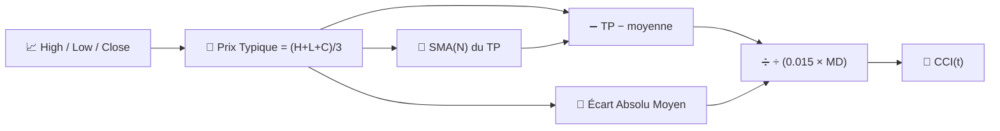

# 🔄 CCI — Commodity Channel Index (Indice de Canal des Matières Premières)

Le CCI mesure à quel point le « prix typique » actuel s'est écarté de sa propre moyenne récente, exprimé en unités d'**écart absolu moyen** plutôt que d'écart-type. Malgré son nom, il est utilisé pour toutes les classes d'actifs, pas uniquement les matières premières.

---

## 💡 Signification Financière

Le CCI a été conçu pour signaler le début de nouveaux cycles : des lectures au-delà de +100 suggèrent que le prix est inhabituellement fort par rapport à sa propre fourchette typique récente, tandis que les lectures en dessous de −100 suggèrent une faiblesse inhabituelle. Contrairement au RSI, le CCI est **non borné** — il peut dépasser largement ±100 lors de tendances fortes, donc les lectures extrêmes doivent être interprétées comme une « force » plutôt qu'un signal de retournement automatique.

---

## 🔢 Formules Mathématiques

1. **Prix Typique** pour chaque barre :

    $$
    TP_t = \frac{H_t + L_t + C_t}{3}
    $$

2. **Moyenne mobile simple** du prix typique, et son **écart absolu moyen** :

    $$
    \overline{TP}_t = SMA_N(TP), \qquad
    MD_t = \frac{1}{N}\sum_{i=0}^{N-1} \left| TP_{t-i} - \overline{TP}_t \right|
    $$

3. **CCI**, mis à l'échelle par la constante conventionnelle $0.015$ de sorte qu'environ 70 à 80 % des valeurs se situent dans $\pm 100$ :

    $$
    CCI_t = \frac{TP_t - \overline{TP}_t}{0.015 \cdot MD_t}
    $$

---

## ⚙️ Paramètres

| Paramètre | Clé | Défaut | Description |
|---|---|---|---|
| Période ($N$) | `period` | 14 | Fenêtre pour la moyenne du prix typique et l'écart moyen. |

---

## 🎛️ Équivalent en Traitement du Signal — Normalisation par l'Erreur Absolue Moyenne

Le CCI est structurellement similaire à un $z$-score de Bandes de Bollinger, mais il normalise par **l'écart absolu moyen (MAD)** au lieu de l'écart-type. Le MAD est une estimation *robuste* (moins sensible aux valeurs aberrantes) de la dispersion que $\sigma$, ce qui explique pourquoi le CCI réagit généralement moins violemment à une barre extrême unique qu'une normalisation de type Bollinger.

!!! note "±100 est une convention, pas une loi"

    La constante $0.015$ a été choisie par Donald Lambert de sorte qu'empiriquement, 70 à 80 % des
    valeurs du CCI se situent entre −100 et +100 pour les instruments typiques. Il s'agit d'un calibrage
    heuristique, pas d'une garantie statistique — contrairement à la borne 0–100 mathématiquement fixe du RSI.

:material-link: [Commodity Channel Index sur Wikipédia](https://en.wikipedia.org/wiki/Commodity_channel_index){ target="_blank" }
