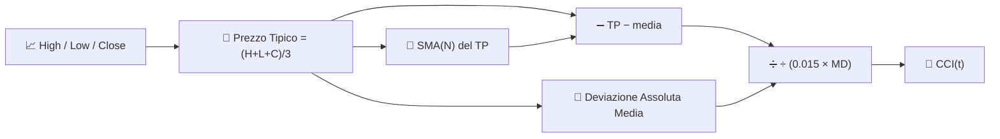

# 🔄 CCI — Commodity Channel Index (Indice del Canale delle Materie Prime)

Il CCI misura quanto il "prezzo tipico" corrente si è allontanato dalla sua media recente, espresso in unità di **deviazione assoluta media** anziché deviazione standard. Nonostante il nome, viene utilizzato in tutte le classi di asset, non solo nelle materie prime.

---

## 💡 Significato Finanziario

Il CCI è stato progettato per segnalare l'inizio di nuovi cicli: letture oltre +100 suggeriscono che il prezzo è insolitamente forte rispetto al suo recente range tipico, mentre letture inferiori a −100 suggeriscono una debolezza insolita. A differenza dell'RSI, il CCI è **senza limiti** — può spingersi ben oltre ±100 durante forti trend, quindi letture estreme dovrebbero essere interpretate come "forza" piuttosto che come un segnale automatico di inversione.

---

## 🔢 Formule Matematiche

1. **Prezzo Tipico** per ogni barra:

    $$
    TP_t = \frac{H_t + L_t + C_t}{3}
    $$

2. **Media mobile semplice** del prezzo tipico e sua **deviazione assoluta media**:

    $$
    \overline{TP}_t = SMA_N(TP), \qquad
    MD_t = \frac{1}{N}\sum_{i=0}^{N-1} \left| TP_{t-i} - \overline{TP}_t \right|
    $$

3. **CCI**, scalato dalla costante convenzionale $0.015$ in modo che circa il 70–80% dei valori cada all'interno di $\pm 100$:

    $$
    CCI_t = \frac{TP_t - \overline{TP}_t}{0.015 \cdot MD_t}
    $$

---

## ⚙️ Parametri

| Parametro | Chiave | Default | Descrizione |
|---|---|---|---|
| Periodo ($N$) | `period` | 14 | Finestra per la media del prezzo tipico e la deviazione media. |

---

## 🎛️ Equivalente nell'Elaborazione dei Segnali — Deviazione Normalizzata dall'Errore Assoluto Medio

Il CCI è strutturalmente simile a uno $z$-score delle Bande di Bollinger, ma normalizza utilizzando la **deviazione assoluta media (MAD)** invece della deviazione standard. La MAD è una stima della dispersione più *robusta* (meno sensibile agli outlier) rispetto a $\sigma$, motivo per cui il CCI tende a reagire in modo meno violento a singole barre estreme rispetto a una normalizzazione in stile Bollinger.

!!! note "±100 è una convenzione, non una legge"

    La costante $0.015$ è stata scelta da Donald Lambert in modo che, empiricamente,
    il 70–80% dei valori CCI cada tra −100 e +100 per strumenti tipici. Si tratta di
    una calibrazione euristica, non di una garanzia statistica — a differenza del
    limite 0–100 matematicamente fisso dell'RSI.

:material-link: [Commodity Channel Index su Wikipedia](https://en.wikipedia.org/wiki/Commodity_channel_index){ target="_blank" }
