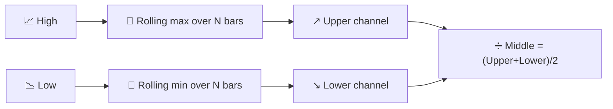

# ↔️ Donchian Channels

Donchian Channels draw the simplest possible volatility envelope: the highest high and lowest low over the last $N$ periods, with no averaging or weighting at all — pure extrema.

---

## 💡 Financial Meaning

This is the indicator behind the legendary "Turtle Trading" breakout system: buy when price closes above the upper channel (a new $N$-period high), sell/short when it closes below the lower channel. The width of the channel also doubles as a volatility gauge — a wide channel means the market has ranged broadly over the window, a narrow one means it has been unusually contained.

---

## 🔢 Mathematical Formulas

1.  **Upper Channel** — the rolling maximum of the high over the window:

    $$
    Upper_t = \max_{0 \le i < N} H_{t-i}
    $$

2.  **Lower Channel** — the rolling minimum of the low over the window:

    $$
    Lower_t = \min_{0 \le i < N} L_{t-i}
    $$

3.  **Middle Line** — the simple midpoint of the two:

    $$
    Middle_t = \frac{Upper_t + Lower_t}{2}
    $$

---

## ⚙️ Parameters

| Parameter | Key | Default | Description |
|---|---|---|---|
| Period ($N$) | `period` | 20 | Lookback window for the rolling max/min. |

---

## 🎛️ Signal Processing Equivalent — Sliding-Window Max/Min (Morphological Filter)

Donchian's channel construction is a **max filter** and a **min filter** applied over a sliding window — exactly the *dilation* and *erosion* operators from mathematical morphology, applied here in one dimension. Unlike every averaging filter in this catalogue, a max/min filter is **not linear**: it cannot be described by a convolution or a transfer function $H(z)$, and it responds instantaneously to a new extreme rather than blending it in gradually.

!!! info "Step-function behaviour"

    Because the channel only updates when a *new* extreme appears, both bands move
    in discrete steps rather than smoothly — a sharp contrast with Bollinger Bands,
    whose $\pm k\sigma$ envelope reacts gradually to every new observation.

:material-link: [Donchian channel on Wikipedia](https://en.wikipedia.org/wiki/Donchian_channel){ target="_blank" }
