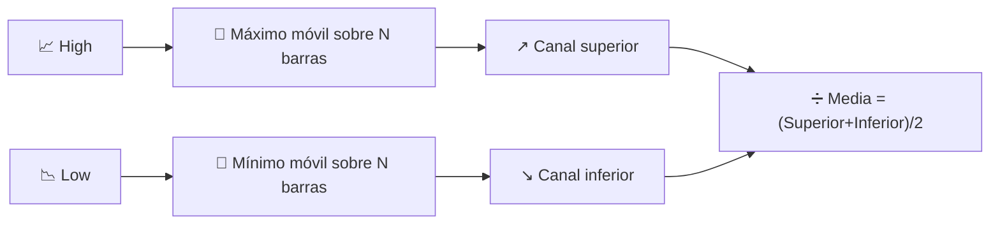

# ↔️ Canales Donchian

Los Canales Donchian dibujan la envolvente de volatilidad más simple posible: el máximo más alto y el mínimo más bajo de los últimos $N$ períodos, sin ningún promedio ni ponderación — solo extremos puros.

---

## 💡 Significado Financiero

Este es el indicador detrás del legendario sistema de ruptura "Turtle Trading": comprar cuando el precio cierra por encima del canal superior (un nuevo máximo de $N$ períodos), vender/poner en corto cuando cierra por debajo del canal inferior. La anchura del canal también funciona como un indicador de volatilidad — un canal ancho significa que el mercado se ha movido en un rango amplio durante la ventana, uno estrecho significa que ha estado inusualmente contenido.

---

## 🔢 Fórmulas Matemáticas

1. **Canal Superior** — el máximo móvil del high durante la ventana:

    $$
    Upper_t = \max_{0 \le i < N} H_{t-i}
    $$

2. **Canal Inferior** — el mínimo móvil del low durante la ventana:

    $$
    Lower_t = \min_{0 \le i < N} L_{t-i}
    $$

3. **Línea Media** — el punto medio simple de los dos:

    $$
    Middle_t = \frac{Upper_t + Lower_t}{2}
    $$

---

## ⚙️ Parámetros

| Parámetro | Clave | Valor por defecto | Descripción |
|---|---|---|---|
| Período ($N$) | `period` | 20 | Ventana de retroceso para el máximo/mínimo móvil. |

---

## 🎛️ Equivalente de Procesamiento de Señales — Máximo/Mínimo de Ventana Deslizante (Filtro Morfológico)

La construcción del canal de Donchian es un **filtro de máximo** y un **filtro de mínimo** aplicados sobre una ventana deslizante — exactamente los operadores de *dilatación* y *erosión* de la morfología matemática, aplicados aquí en una dimensión. A diferencia de todos los filtros de promedio en este catálogo, un filtro de máximo/mínimo **no es lineal**: no puede describirse mediante una convolución o una función de transferencia $H(z)$, y responde instantáneamente a un nuevo extremo en lugar de incorporarlo gradualmente.

!!! info "Comportamiento escalonado"

    Debido a que el canal solo se actualiza cuando aparece un *nuevo* extremo, ambas bandas se mueven
    en pasos discretos en lugar de hacerlo de forma suave — un marcado contraste con las Bandas de Bollinger,
    cuya envolvente de $\pm k\sigma$ reacciona gradualmente a cada nueva observación.

:material-link: [Canal Donchian en Wikipedia](https://en.wikipedia.org/wiki/Donchian_channel){ target="_blank" }
