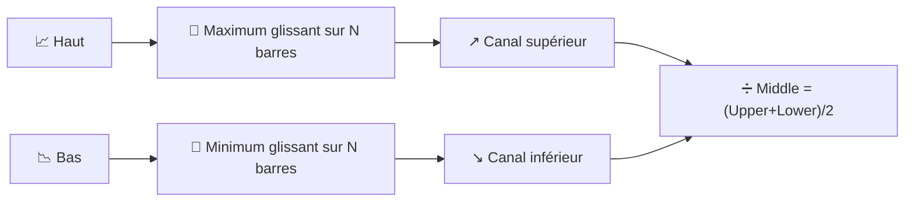

# ↔️ Canaux Donchian

Les canaux Donchian dessinent la plus simple enveloppe de volatilité possible : le plus haut haut et le plus bas bas sur les $N$ dernières périodes, sans aucune moyenne ni pondération — que des purs extrêmes.

---

## 💡 Signification financière

Il s'agit de l'indicateur derrière le légendaire système de "breakout Turtle Trading" (trading des tortues) : achetez lorsque le prix clôture au-dessus du canal supérieur (un nouveau sommet sur $N$ périodes), vendez/vendez à découvert lorsqu'il clôture en dessous du canal inférieur. La largeur du canal sert également de jauge de volatilité — un canal large signifie que le marché a évolué sur une large fourchette pendant la fenêtre, un canal étroit signifie qu'il a été inhabituellement contenu.

---

## 🔢 Formules mathématiques

1. **Canal supérieur** — le maximum glissant du haut sur la fenêtre :

    $$
    Upper_t = \max_{0 \le i < N} H_{t-i}
    $$

2. **Canal inférieur** — le minimum glissant du bas sur la fenêtre :

    $$
    Lower_t = \min_{0 \le i < N} L_{t-i}
    $$

3. **Ligne médiane** — le simple point milieu des deux :

    $$
    Middle_t = \frac{Upper_t + Lower_t}{2}
    $$

---

## ⚙️ Paramètres

| Paramètre | Clé | Défaut | Description |
|---|---|---|---|
| Période ($N$) | `period` | 20 | Fenêtre de rétrospection pour le max/min glissant. |

---

## 🎛️ Équivalent en traitement du signal — Max/Min sur fenêtre glissante (filtre morphologique)

La construction du canal Donchian est un **filtre max** et un **filtre min** appliqués sur une fenêtre glissante — exactement les opérateurs de *dilatation* et d'*érosion* issus de la morphologie mathématique, appliqués ici en une dimension. Contrairement à tous les filtres de moyenne de ce catalogue, un filtre max/min **n'est pas linéaire** : il ne peut être décrit par une convolution ou une fonction de transfert $H(z)$, et il répond instantanément à un nouvel extrême plutôt que de l'intégrer progressivement.

!!! info "Comportement en fonction échelon"

    Comme le canal se met à jour uniquement lorsqu'un *nouvel* extrême apparaît, les deux bandes
    évoluent par paliers discrets plutôt que de manière lisse — un contraste marqué avec les bandes de Bollinger,
    dont l'enveloppe $\pm k\sigma$ réagit graduellement à chaque nouvelle observation.

:material-link: [Canal Donchian sur Wikipédia](https://en.wikipedia.org/wiki/Donchian_channel){ target="_blank" }
