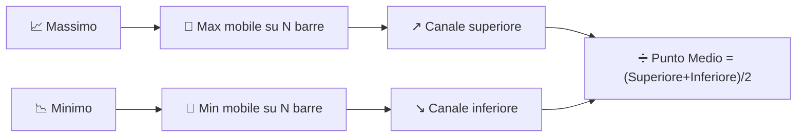

# ↔️ Canali Donchian

I canali Donchian tracciano l'inviluppo di volatilità più semplice possibile: il massimo più alto e il minimo più basso negli ultimi $N$ periodi, senza alcuna media o ponderazione — puri estremi.

---

## 💡 Significato Finanziario

Questo è l'indicatore alla base del leggendario sistema di breakout "Turtle Trading": acquista quando il prezzo chiude sopra il canale superiore (un nuovo massimo di $N$ periodi), vendi/vai corto quando chiude sotto il canale inferiore. L'ampiezza del canale funge anche da indicatore di volatilità — un canale ampio significa che il mercato ha oscillato ampiamente nella finestra, uno stretto significa che è stato insolitamente contenuto.

---

## 🔢 Formule Matematiche

1. **Canale Superiore** — il massimo mobile del prezzo massimo sulla finestra:

    $$
    Upper_t = \max_{0 \le i < N} H_{t-i}
    $$

2. **Canale Inferiore** — il minimo mobile del prezzo minimo sulla finestra:

    $$
    Lower_t = \min_{0 \le i < N} L_{t-i}
    $$

3. **Punto Medio** — il semplice punto medio dei due:

    $$
    Middle_t = \frac{Upper_t + Lower_t}{2}
    $$

---

## ⚙️ Parametri

| Parametro | Chiave | Default | Descrizione |
|---|---|---|---|
| Periodo ($N$) | `period` | 20 | Finestra di lookback per il max/min mobile. |

---

## 🎛️ Equivalente nell'Elaborazione dei Segnali — Max/Min a Finestra Scorrevole (Filtro Morfologico)

La costruzione del canale Donchian è un **filtro di massimo** e un **filtro di minimo** applicati su una finestra scorrevole — esattamente gli operatori di *dilatazione* ed *erosione* della morfologia matematica, applicati qui in una dimensione. A differenza di ogni filtro di media in questo catalogo, un filtro max/min **non è lineare**: non può essere descritto da una convoluzione o da una funzione di trasferimento $H(z)$, e risponde istantaneamente a un nuovo estremo anziché integrarlo gradualmente.

!!! info "Comportamento a gradino"

    Poiché il canale si aggiorna solo quando appare un *nuovo* estremo, entrambe le bande
    si muovono a scatti anziché in modo graduale — un netto contrasto con le Bande di Bollinger,
    il cui inviluppo $\pm k\sigma$ reagisce gradualmente a ogni nuova osservazione.

:material-link: [Canale Donchian su Wikipedia](https://en.wikipedia.org/wiki/Donchian_channel){ target="_blank" }
