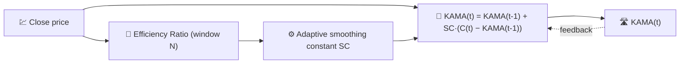

# 🛣️ KAMA — Kaufman Adaptive Moving Average

KAMA is a moving average that **changes its own smoothing speed** depending on how efficiently the price is trending. In a strong trend it hugs the price closely; in a choppy, sideways market it flattens out almost like a long-period SMA.

---

## 💡 Financial Meaning

A fixed-period EMA is a compromise: fast enough to follow trends, but noisy in ranging markets — or the opposite. KAMA removes that trade-off by measuring, at every bar, how much of the raw price movement was "useful" directional travel versus wasted back-and-forth noise, and adapting instantly.

---

## 🔢 Mathematical Formula

1.  **Efficiency Ratio** over the lookback window $N$ — net distance travelled divided by the total path length walked:

    $$
    ER_t = \frac{\left| C_t - C_{t-N} \right|}{\sum_{i=0}^{N-1} \left| C_{t-i} - C_{t-i-1} \right|}
    $$

    $ER_t \in [0, 1]$: it is $1$ for a perfectly straight trend and near $0$ for pure noise.

2.  **Adaptive smoothing constant**, interpolating between a fast and a slow EMA constant:

    $$
    SC_t = \left[ ER_t \cdot (\alpha_{fast} - \alpha_{slow}) + \alpha_{slow} \right]^2
    $$

3.  **Recurrence**, identical in form to the EMA but with a time-varying coefficient:

    $$
    KAMA_t = KAMA_{t-1} + SC_t \cdot (C_t - KAMA_{t-1})
    $$

---

## ⚙️ Parameters

| Parameter | Key | Default | Description |
|---|---|---|---|
| Period ($N$) | `period` | 10 | Lookback window for the Efficiency Ratio. |

!!! note "Fast/slow constants are not exposed"

    The classic Kaufman formulation derives $\alpha_{fast}$ and $\alpha_{slow}$ from
    fixed 2-period and 30-period EMA constants ($\alpha_{fast}=2/3$,
    $\alpha_{slow}\approx 0.065$). LibreFolio's TA-Lib–backed implementation only
    exposes the Efficiency Ratio lookback (`period`) — the fast/slow constants are
    internal library defaults, not a user-configurable parameter.

---

## 🎛️ Signal Processing Equivalent — Adaptive-Gain IIR Filter

KAMA is the same **first-order IIR recurrence** as the EMA, but with a self-tuning gain $SC_t$ instead of a fixed $\alpha$. This is precisely the structure of an **adaptive filter** (e.g. a simplified LMS-style filter): the "signal-to-noise ratio" of the input ($ER_t$) continuously re-tunes the pole location $z = 1 - SC_t$.

!!! tip "Trending vs ranging pole"

    When $ER_t \to 1$ (clean trend), $SC_t \to \alpha_{fast}^2 \approx 0.44$ — a very
    reactive pole close to the origin. When $ER_t \to 0$ (pure noise), $SC_t \to
    \alpha_{slow}^2 \approx 0.004$ — an extremely sluggish pole near the unit circle,
    close to a long SMA.

:material-link: [KAMA description (StockCharts)](https://school.stockcharts.com/doku.php?id=technical_indicators:kaufman_s_adaptive_moving_average){ target="_blank" }
