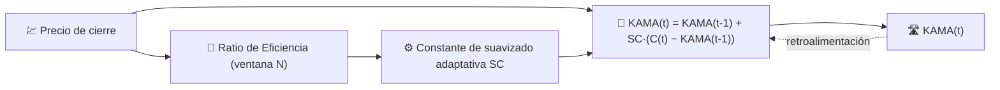

# 🛣️ KAMA — Media Móvil Adaptativa de Kaufman

KAMA es una media móvil que **cambia su propia velocidad de suavizado** dependiendo de la eficiencia con la que el precio sigue una tendencia. En una tendencia fuerte se adhiere al precio; en un mercado lateral sin tendencia se aplana casi como una SMA de período largo.

---

## 💡 Significado Financiero

Una EMA de período fijo es un compromiso: lo suficientemente rápida para seguir tendencias, pero ruidosa en mercados laterales — o viceversa. KAMA elimina esa disyuntiva midiendo, en cada barra, cuánto del movimiento del precio en bruto fue un desplazamiento direccional "útil" en lugar de ruido de vaivén desperdiciado, y adaptándose instantáneamente.

---

## 🔢 Fórmula Matemática

1. **Ratio de Eficiencia** sobre la ventana de retroceso $N$ — distancia neta recorrida dividida por la longitud total del camino recorrido:

    $$
    ER_t = \frac{\left| C_t - C_{t-N} \right|}{\sum_{i=0}^{N-1} \left| C_{t-i} - C_{t-i-1} \right|}
    $$

 $ER_t \in [0, 1]$: es $1$ para una tendencia perfectamente recta y cercano a $0$ para ruido puro.

2. **Constante de suavizado adaptativa**, interpolando entre una constante EMA rápida y una lenta:

    $$
    SC_t = \left[ ER_t \cdot (\alpha_{fast} - \alpha_{slow}) + \alpha_{slow} \right]^2
    $$

3. **Recurrencia**, idéntica en forma a la EMA pero con un coeficiente que varía en el tiempo:

    $$
    KAMA_t = KAMA_{t-1} + SC_t \cdot (C_t - KAMA_{t-1})
    $$

---

## ⚙️ Parámetros

| Parámetro | Clave | Valor por defecto | Descripción |
|---|---|---|---|
| Período ($N$) | `period` | 10 | Ventana de retroceso para el Ratio de Eficiencia. |

!!! note "Las constantes rápida/lenta no están expuestas"

    La formulación clásica de Kaufman deriva $\alpha_{fast}$ y $\alpha_{slow}$ a partir de
    constantes EMA fijas de 2 y 30 períodos ($\alpha_{fast}=2/3$,
    $\alpha_{slow}\approx 0.065$). La implementación de LibreFolio basada en TA-Lib solo
    expone la ventana de retroceso del Ratio de Eficiencia (`period`) — las constantes rápida/lenta son
    valores internos por defecto de la librería, no un parámetro configurable por el usuario.

---

## 🎛️ Equivalente en Procesamiento de Señales — Filtro IIR de Ganancia Adaptativa

KAMA es la misma **recurrencia IIR de primer orden** que la EMA, pero con una ganancia autoajustable $SC_t$ en lugar de un $\alpha$ fijo. Esta es precisamente la estructura de un **filtro adaptativo** (por ejemplo, un filtro simplificado tipo LMS): la "relación señal-ruido" de la entrada ($ER_t$) reajusta continuamente la ubicación del polo $z = 1 - SC_t$.

!!! tip "Polo en tendencia vs. lateral"

    Cuando $ER_t \to 1$ (tendencia limpia), $SC_t \to \alpha_{fast}^2 \approx 0.44$ — un polo
    muy reactivo cercano al origen. Cuando $ER_t \to 0$ (ruido puro), $SC_t \to
    \alpha_{slow}^2 \approx 0.004$ — un polo extremadamente lento cerca del círculo unitario,
    similar a una SMA larga.

:material-link: [Descripción de KAMA (StockCharts)](https://school.stockcharts.com/doku.php?id=technical_indicators:kaufman_s_adaptive_moving_average){ target="_blank" }
