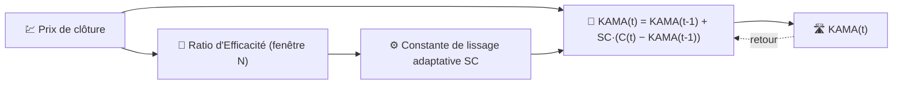

# 🛣️ KAMA — Moyenne Mobile Adaptative de Kaufman

KAMA est une moyenne mobile qui **modifie sa propre vitesse de lissage** en fonction de l'efficacité de la tendance des prix. Dans une tendance forte, elle suit les prix de près ; dans un marché agité et sans direction, elle s'aplatit presque comme une SMA à longue période.

---

## 💡 Signification Financière

Une EMA à période fixe est un compromis : suffisamment rapide pour suivre les tendances, mais bruyante dans les marchés en range — ou l'inverse. KAMA supprime ce compromis en mesurant, à chaque barre, quelle part du mouvement brut des prix était un déplacement directionnel "utile" par rapport au bruit de va-et-vient perdu, et en s'adaptant instantanément.

---

## 🔢 Formule Mathématique

1. **Ratio d'Efficacité** sur la fenêtre de rétrospection $N$ — distance nette parcourue divisée par la longueur totale du chemin parcouru :

    $$
    ER_t = \frac{\left| C_t - C_{t-N} \right|}{\sum_{i=0}^{N-1} \left| C_{t-i} - C_{t-i-1} \right|}
    $$

 $ER_t \in [0, 1]$ : il vaut $1$ pour une tendance parfaitement droite et près de $0$ pour du bruit pur.

2. **Constante de lissage adaptative**, interpolant entre une constante EMA rapide et une constante EMA lente :

    $$
    SC_t = \left[ ER_t \cdot (\alpha_{rapide} - \alpha_{lent}) + \alpha_{lent} \right]^2
    $$

3. **Récurrence**, de forme identique à l'EMA mais avec un coefficient variant dans le temps :

    $$
    KAMA_t = KAMA_{t-1} + SC_t \cdot (C_t - KAMA_{t-1})
    $$

---

## ⚙️ Paramètres

| Paramètre | Clé | Défaut | Description |
|---|---|---|---|
| Période ($N$) | `period` | 10 | Fenêtre de rétrospection pour le Ratio d'Efficacité. |

!!! note "Les constantes rapide/lente ne sont pas exposées"

    La formulation classique de Kaufman dérive $\alpha_{rapide}$ et $\alpha_{lent}$ à partir
    de constantes EMA fixes sur 2 et 30 périodes ($\alpha_{rapide}=2/3$,
    $\alpha_{lent}\approx 0,065$). L'implémentation de LibreFolio basée sur TA-Lib n'expose
    que la fenêtre de rétrospection du Ratio d'Efficacité (`period`) — les constantes
    rapide/lente sont les valeurs par défaut internes de la bibliothèque, et non un paramètre
    configurable par l'utilisateur.

---

## 🎛️ Équivalent en Traitement du Signal — Filtre IIR à Gain Adaptatif

KAMA est la même **récurrence IIR du premier ordre** que l'EMA, mais avec un gain auto-ajustable $SC_t$ au lieu d'un $\alpha$ fixe. C'est précisément la structure d'un **filtre adaptatif** (par exemple, un filtre de type LMS simplifié) : le "rapport signal sur bruit" de l'entrée ($ER_t$) réajuste en continu l'emplacement du pôle $z = 1 - SC_t$.

!!! tip "Pôle en tendance vs en range"

    Lorsque $ER_t \to 1$ (tendance claire), $SC_t \to \alpha_{rapide}^2 \approx 0,44$ — un pôle
    très réactif proche de l'origine. Lorsque $ER_t \to 0$ (bruit pur), $SC_t \to
    \alpha_{lent}^2 \approx 0,004$ — un pôle extrêmement lent près du cercle unité,
    proche d'une longue SMA.

:material-link: [Description de KAMA (StockCharts)](https://school.stockcharts.com/doku.php?id=technical_indicators:kaufman_s_adaptive_moving_average){ target="_blank" }
