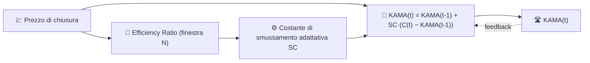

# 🛣️ KAMA — Media Mobile Adattativa di Kaufman

KAMA è una media mobile che **modifica la propria velocità di smussamento** in base all'efficienza del trend del prezzo. In un trend forte segue il prezzo da vicino; in un mercato laterale e rumoroso si appiattisce quasi come una SMA a lungo periodo.

---

## 💡 Significato Finanziario

Una EMA a periodo fisso è un compromesso: abbastanza veloce da seguire i trend, ma rumorosa nei mercati laterali — o viceversa. KAMA elimina questo compromesso misurando, ad ogni barra, quanto del movimento grezzo del prezzo è stato un movimento direzionale "utile" rispetto al rumore sprecato degli andirivieni, e adattandosi istantaneamente.

---

## 🔢 Formula Matematica

1. **Efficiency Ratio** sulla finestra di lookback $N$ — distanza netta percorsa divisa per la lunghezza totale del percorso effettuato:

    $$
    ER_t = \frac{\left| C_t - C_{t-N} \right|}{\sum_{i=0}^{N-1} \left| C_{t-i} - C_{t-i-1} \right|}
    $$

 $ER_t \in [0, 1]$: vale $1$ per un trend perfettamente lineare e vicino a $0$ per puro rumore.

2. **Costante di smussamento adattativa**, che interpola tra una costante EMA veloce e una lenta:

    $$
    SC_t = \left[ ER_t \cdot (\alpha_{fast} - \alpha_{slow}) + \alpha_{slow} \right]^2
    $$

3. **Ricorrenza**, identica nella forma all'EMA ma con un coefficiente variabile nel tempo:

    $$
    KAMA_t = KAMA_{t-1} + SC_t \cdot (C_t - KAMA_{t-1})
    $$

---

## ⚙️ Parametri

| Parametro | Chiave | Default | Descrizione |
|---|---|---|---|
| Periodo ($N$) | `period` | 10 | Finestra di lookback per l'Efficiency Ratio. |

!!! note "Le costanti fast/slow non sono esposte"

    La formulazione classica di Kaufman deriva $\alpha_{fast}$ e $\alpha_{slow}$ da
    costanti EMA fisse a 2 e 30 periodi ($\alpha_{fast}=2/3$,
    $\alpha_{slow}\approx 0.065$). L'implementazione di LibreFolio basata su TA-Lib espone
    solo il lookback dell'Efficiency Ratio (`period`) — le costanti fast/slow sono
    valori predefiniti interni della libreria, non un parametro configurabile dall'utente.

---

## 🎛️ Equivalente nell'Elaborazione dei Segnali — Filtro IIR a Guadagno Adattativo

KAMA è la stessa **ricorrenza IIR del primo ordine** dell'EMA, ma con un guadagno auto-regolante $SC_t$ invece di un $\alpha$ fisso. Questa è precisamente la struttura di un **filtro adattativo** (ad esempio, un filtro LMS semplificato): il "rapporto segnale-rumore" dell'input ($ER_t$) ri-sintonizza continuamente la posizione del polo $z = 1 - SC_t$.

!!! tip "Polo in trend vs polo in range laterale"

    Quando $ER_t \to 1$ (trend pulito), $SC_t \to \alpha_{fast}^2 \approx 0.44$ — un polo molto
    reattivo vicino all'origine. Quando $ER_t \to 0$ (puro rumore), $SC_t \to
    \alpha_{slow}^2 \approx 0.004$ — un polo estremamente lento vicino al cerchio unitario,
    simile a una SMA lunga.

:material-link: [Descrizione KAMA (StockCharts)](https://school.stockcharts.com/doku.php?id=technical_indicators:kaufman_s_adaptive_moving_average){ target="_blank" }
