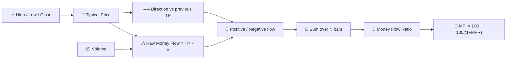

# 💸 MFI — Money Flow Index

MFI is often described as "volume-weighted RSI": it applies RSI's gain/loss ratio logic not to raw price changes, but to **money flow** — typical price multiplied by volume — so a move only counts as strongly as the activity behind it.

---

## 💡 Financial Meaning

A price rise on heavy volume produces a much larger positive money flow than the same percentage rise on thin volume. MFI captures that distinction, which plain RSI cannot see at all. Like RSI, it is read with overbought/oversold thresholds, but a reading above 80 means buying pressure has been both persistent *and* well-supported by volume — arguably a stronger signal than an RSI overbought reading alone.

---

## 🔢 Mathematical Formulas

1.  **Typical Price** and **Raw Money Flow** for each bar:

    $$
    TP_t = \frac{H_t + L_t + C_t}{3}, \qquad
    RMF_t = TP_t \cdot V_t
    $$

2.  **Positive/negative flow**, split by the direction of the typical price versus the previous bar:

    $$
    PMF_t = RMF_t \text{ if } TP_t > TP_{t-1} \text{ else } 0, \qquad
    NMF_t = RMF_t \text{ if } TP_t < TP_{t-1} \text{ else } 0
    $$

3.  **Money Flow Ratio** over the window, and its normalisation into the **MFI**:

    $$
    MFR_t = \frac{\sum_{i=0}^{N-1} PMF_{t-i}}{\sum_{i=0}^{N-1} NMF_{t-i}}, \qquad
    MFI_t = 100 - \frac{100}{1+MFR_t}
    $$

---

## ⚙️ Parameters

| Parameter | Key | Default | Description |
|---|---|---|---|
| Period ($N$) | `period` | 14 | Lookback window for accumulating positive/negative money flow. |
| Overbought | `overbought` | 80 | Threshold for the overbought zone. |
| Oversold | `oversold` | 20 | Threshold for the oversold zone. |

---

## 🎛️ Signal Processing Equivalent — Volume-Weighted Duty Cycle

MFI reuses RSI's exact normalisation, $100 - 100/(1+x)$, but replaces RSI's *unweighted* gain/loss sums with volume-weighted ones. In signal-processing terms, this is the same **duty-cycle / saturation detector** described for [RSI](rsi.md), except the rectified positive and negative half-waves of price change are each **amplitude-modulated by volume** before accumulation — volume acts as a per-sample weighting (gain) applied to the rectified derivative.

!!! tip "MFI vs RSI"

    Feed MFI the exact same close-price pattern as RSI but with volume spiking on
    the up-moves and thinning on the down-moves, and MFI will read *higher* than
    RSI — the volume weighting tilts the ratio in favour of the better-supported
    direction.

:material-link: [Money Flow Index on Wikipedia](https://en.wikipedia.org/wiki/Money_flow_index){ target="_blank" }
