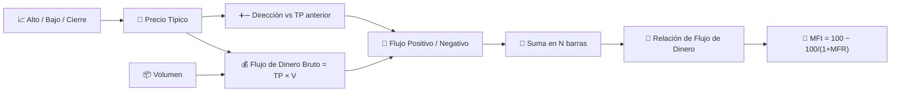

# 💸 MFI — Índice de Flujo de Dinero

El MFI a menudo se describe como "RSI ponderado por volumen": aplica la lógica de relación de ganancias/pérdidas del RSI no a los cambios de precio brutos, sino al **flujo de dinero** — precio típico multiplicado por el volumen — por lo que un movimiento solo cuenta tan fuerte como la actividad que lo respalda.

---

## 💡 Significado Financiero

Un aumento de precio con un volumen alto produce un flujo de dinero positivo mucho mayor que el mismo aumento porcentual con un volumen bajo. El MFI captura esa distinción, que el RSI simple no puede detectar en absoluto. Al igual que el RSI, se interpreta con umbrales de sobrecompra/sobreventa, pero una lectura por encima de 80 significa que la presión de compra ha sido persistente *y* bien respaldada por el volumen — posiblemente una señal más fuerte que una lectura de sobrecompra del RSI por sí sola.

---

## 🔢 Fórmulas Matemáticas

1. **Precio Típico** y **Flujo de Dinero Bruto** para cada barra:

    $$
    TP_t = \frac{H_t + L_t + C_t}{3}, \qquad
    RMF_t = TP_t \cdot V_t
    $$

2. **Flujo positivo/negativo**, dividido por la dirección del precio típico en comparación con la barra anterior:

    $$
    PMF_t = RMF_t \text{ si } TP_t > TP_{t-1} \text{ de lo contrario } 0, \qquad
    NMF_t = RMF_t \text{ si } TP_t < TP_{t-1} \text{ de lo contrario } 0
    $$

3. **Relación de Flujo de Dinero** en la ventana, y su normalización en el **MFI**:

    $$
    MFR_t = \frac{\sum_{i=0}^{N-1} PMF_{t-i}}{\sum_{i=0}^{N-1} NMF_{t-i}}, \qquad
    MFI_t = 100 - \frac{100}{1+MFR_t}
    $$

---

## ⚙️ Parámetros

| Parámetro | Clave | Valor por Defecto | Descripción |
|---|---|---|---|
| Período ($N$) | `period` | 14 | Ventana de retroceso para acumular flujo de dinero positivo/negativo. |
| Sobrecompra | `overbought` | 80 | Umbral para la zona de sobrecompra. |
| Sobreventa | `oversold` | 20 | Umbral para la zona de sobreventa. |

---

## 🎛️ Equivalente en Procesamiento de Señales — Ciclo de Trabajo Ponderado por Volumen

El MFI reutiliza la misma normalización exacta del RSI, $100 - 100/(1+x)$, pero reemplaza las sumas de ganancias/pérdidas *no ponderadas* del RSI por unas ponderadas por volumen. En términos de procesamiento de señales, este es el mismo **detector de ciclo de trabajo / saturación** descrito para [RSI](rsi.md), excepto que las medias ondas positivas y negativas rectificadas del cambio de precio son cada una **moduladas en amplitud por el volumen** antes de la acumulación — el volumen actúa como una ponderación (ganancia) por muestra aplicada a la derivada rectificada.

!!! tip "MFI vs RSI"

    Alimenta al MFI el mismo patrón exacto de precios de cierre que al RSI, pero con
    el volumen aumentando en los movimientos alcistas y disminuyendo en los bajistas,
    y el MFI leerá *más alto* que el RSI — la ponderación por volumen inclina la
    relación a favor de la dirección mejor respaldada.

:material-link: [Índice de Flujo de Dinero en Wikipedia](https://en.wikipedia.org/wiki/Money_flow_index){ target="_blank" }
