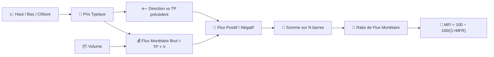

# 💸 MFI — Indice de Flux Monétaire

Le MFI est souvent décrit comme un « RSI pondéré par le volume » : il applique la logique du ratio gain/perte du RSI non pas aux variations brutes de prix, mais au **flux monétaire** — prix typique multiplié par le volume — de sorte qu'un mouvement ne compte que dans la mesure de l'activité qui le sous-tend.

---

## 💡 Signification Financière

Une hausse de prix sur un volume élevé produit un flux monétaire positif bien plus important que le même pourcentage de hausse sur un volume faible. Le MFI capture cette distinction, que le RSI seul ne peut absolument pas voir. Comme le RSI, il se lit avec des seuils de surachat/survente, mais une lecture au-dessus de 80 signifie que la pression d'achat a été à la fois persistante *et* bien soutenue par le volume — un signal sans doute plus fort qu'une simple lecture de surachat du RSI.

---

## 🔢 Formules Mathématiques

1. **Prix Typique** et **Flux Monétaire Brut** pour chaque barre :

    $$
    TP_t = \frac{H_t + L_t + C_t}{3}, \qquad
    RMF_t = TP_t \cdot V_t
    $$

2. **Flux positif/négatif**, réparti selon la direction du prix typique par rapport à la barre précédente :

    $$
    PMF_t = RMF_t \text{ si } TP_t > TP_{t-1} \text{ sinon } 0, \qquad
    NMF_t = RMF_t \text{ si } TP_t < TP_{t-1} \text{ sinon } 0
    $$

3. **Ratio de Flux Monétaire** sur la fenêtre, et sa normalisation en **MFI** :

    $$
    MFR_t = \frac{\sum_{i=0}^{N-1} PMF_{t-i}}{\sum_{i=0}^{N-1} NMF_{t-i}}, \qquad
    MFI_t = 100 - \frac{100}{1+MFR_t}
    $$

---

## ⚙️ Paramètres

| Paramètre | Clé | Défaut | Description |
|---|---|---|---|
| Période ($N$) | `period` | 14 | Fenêtre de rétrospection pour accumuler le flux monétaire positif/négatif. |
| Surachat | `overbought` | 80 | Seuil pour la zone de surachat. |
| Survente | `oversold` | 20 | Seuil pour la zone de survente. |

---

## 🎛️ Équivalent en Traitement du Signal — Cycle de Service Pondéré par le Volume

Le MFI réutilise la normalisation exacte du RSI, $100 - 100/(1+x)$, mais remplace les sommes *non pondérées* des gains/pertes du RSI par des sommes pondérées par le volume. En termes de traitement du signal, il s'agit du même **détecteur de cycle de service / saturation** décrit pour le [RSI](rsi.md), à ceci près que les demi-ondes redressées positive et négative de la variation de prix sont chacune **modulées en amplitude par le volume** avant accumulation — le volume agit comme une pondération (gain) par échantillon appliquée à la dérivée redressée.

!!! tip "MFI vs RSI"

    Si l'on donne au MFI exactement la même configuration de prix de clôture qu'au RSI, mais avec un volume qui explose lors des mouvements haussiers et diminue lors des mouvements baissiers, alors le MFI lira *plus haut* que le RSI — la pondération par le volume fait pencher le ratio en faveur de la direction la mieux soutenue.

:material-link: [Indice de Flux Monétaire sur Wikipédia](https://en.wikipedia.org/wiki/Money_flow_index){ target="_blank" }
