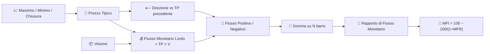

# 💸 MFI — Money Flow Index

MFI è spesso descritto come "RSI pesato per volume": applica la logica del rapporto guadagni/perdite dell'RSI non alle variazioni grezze di prezzo, ma al **flusso monetario** — prezzo tipico moltiplicato per il volume — per cui un movimento conta solo in proporzione all'attività che lo sostiene.

---

## 💡 Significato Finanziario

Un aumento di prezzo su volumi elevati produce un flusso monetario positivo molto maggiore rispetto allo stesso aumento percentuale su volumi bassi. MFI cattura questa distinzione, che il semplice RSI non può vedere. Come l'RSI, viene interpretato con soglie di ipercomprato/ipervenduto, ma una lettura sopra 80 significa che la pressione d'acquisto è stata sia persistente *che* ben supportata dal volume — probabilmente un segnale più forte di una semplice lettura di ipercomprato dell'RSI.

---

## 🔢 Formule Matematiche

1. **Prezzo Tipico** e **Flusso Monetario Lordo** per ogni barra:

    $$
    TP_t = \frac{H_t + L_t + C_t}{3}, \qquad
    RMF_t = TP_t \cdot V_t
    $$

2. **Flusso positivo/negativo**, suddiviso in base alla direzione del prezzo tipico rispetto alla barra precedente:

    $$
    PMF_t = RMF_t \text{ se } TP_t > TP_{t-1} \text{ altrimenti } 0, \qquad
    NMF_t = RMF_t \text{ se } TP_t < TP_{t-1} \text{ altrimenti } 0
    $$

3. **Rapporto di Flusso Monetario** sulla finestra e sua normalizzazione in **MFI**:

    $$
    MFR_t = \frac{\sum_{i=0}^{N-1} PMF_{t-i}}{\sum_{i=0}^{N-1} NMF_{t-i}}, \qquad
    MFI_t = 100 - \frac{100}{1+MFR_t}
    $$

---

## ⚙️ Parametri

| Parametro | Chiave | Predefinito | Descrizione |
|---|---|---|---|
| Periodo ($N$) | `period` | 14 | Finestra di accumulo per il flusso monetario positivo/negativo. |
| Ipercomprato | `overbought` | 80 | Soglia per la zona di ipercomprato. |
| Ipervenduto | `oversold` | 20 | Soglia per la zona di ipervenduto. |

---

## 🎛️ Equivalente nell'Elaborazione dei Segnali — Ciclo di Lavoro Pesato per Volume

MFI riutilizza l'esatta normalizzazione dell'RSI, $100 - 100/(1+x)$, ma sostituisce le somme *non pesate* di guadagni/perdite dell'RSI con quelle pesate per volume. In termini di elaborazione dei segnali, questo è lo stesso **rivelatore di ciclo di lavoro / saturazione** descritto per [RSI](rsi.md), tranne per il fatto che le semionde positive e negative rettificate della variazione di prezzo sono ciascuna **modulate in ampiezza dal volume** prima dell'accumulo — il volume agisce come una ponderazione (guadagno) per campione applicata alla derivata rettificata.

!!! tip "MFI vs RSI"

    Se si fornisce a MFI lo stesso identico pattern di prezzi di chiusura dell'RSI, ma con volumi che aumentano sui movimenti al rialzo e diminuiscono su quelli al ribasso, MFI leggerà *più alto* dell'RSI — la ponderazione per volume inclina il rapporto a favore della direzione meglio supportata.

:material-link: [Money Flow Index su Wikipedia](https://en.wikipedia.org/wiki/Money_flow_index){ target="_blank" }
