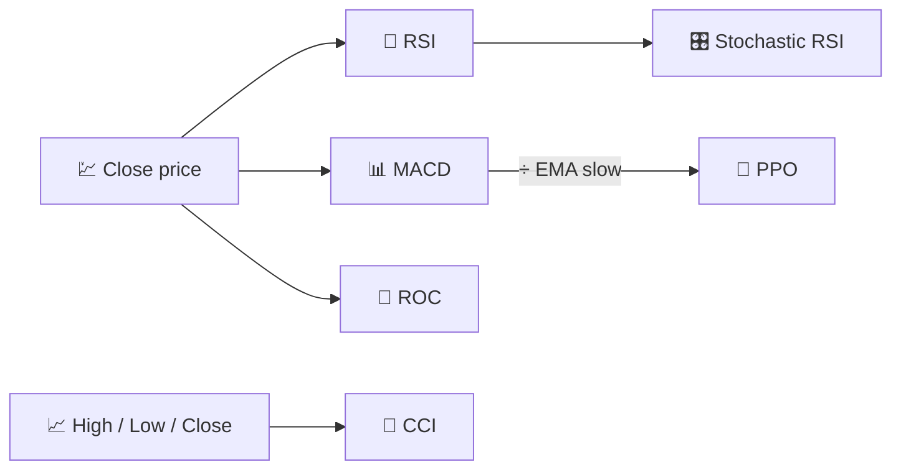

# 🚀 Momentum Indicators

Momentum indicators measure the **speed and persistence** of price moves rather than their level. They answer: *"is the market pushing harder, or is it running out of steam?"*

---

## 💡 What This Group Measures

Mathematically, most momentum indicators are discrete derivatives or rescaled derivatives of price (or of another oscillator, as in Stochastic RSI). They oscillate within a bounded or roughly-bounded range, which makes them natural candidates for **overbought/oversold** interpretation and **divergence** analysis (price makes a new high while momentum does not).

---

## 📋 Indicators in This Category

| Indicator | What It Measures | Key Use | Details |
|-----------|-------------------|---------|---------|
| **RSI** | Recent gain/loss balance | Overbought/oversold, mean reversion | [📖](rsi.md) |
| **MACD** | Trend acceleration | Bullish/bearish crossovers | [📖](macd.md) |
| **ROC** | Percentage price change over $N$ days | Pure momentum, divergence spotting | [📖](roc.md) |
| **Stochastic RSI** | RSI's own overbought/oversold extremes | Faster, more sensitive reversal signals | [📖](stochastic-rsi.md) |
| **PPO** | MACD, normalised by price | Comparing momentum across assets of different price levels | [📖](ppo.md) |
| **CCI** | Deviation from a typical-price average | Cyclical turning points | [📖](cci.md) |

---

## 📥 Data Requirements

| Indicator | Inputs | Notes |
|-----------|--------|-------|
| RSI, MACD, ROC, Stochastic RSI, PPO | `close` | Pure price-derivative oscillators |
| CCI | `high`, `low`, `close` | Uses the *typical price* $(H+L+C)/3$ |

---

## 🔍 Comparison Table

| Indicator | Default Period(s) | Output Range | Bounded? |
|-----------|--------------------|---------------|----------|
| RSI | 14 | 0–100 | Yes |
| MACD | 12 / 26 / 9 | Unbounded (price units) | No |
| ROC | 12 | Unbounded (%) | No |
| Stochastic RSI | 14 / 3 | 0–100 | Yes |
| PPO | 12 / 26 / 9 | Unbounded (%) | No |
| CCI | 14 | Unbounded, ±100 reference | No |

!!! tip "Bounded vs unbounded oscillators"

    RSI and Stochastic RSI are **normalised** (always 0–100), so their thresholds are
    universal across assets. MACD, ROC, PPO and CCI are **scale-dependent** — PPO exists
    precisely to make MACD-like momentum comparable across instruments with very
    different price levels.

---

## 🔗 Related

- 📉 **[All Indicators](index.md)** — Full catalogue with financial and signal-processing views
- 🧭 **[Trend Indicators](trend.md)** — Direction and strength of the underlying move
- 📏 **[Volatility Indicators](volatility.md)** — Dispersion, not direction
