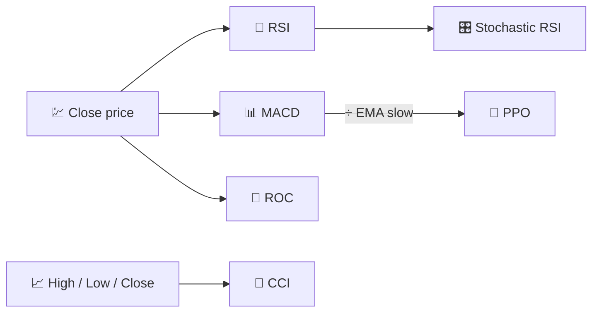

# 🚀 Indicadores de Momento

Los indicadores de momento miden la **velocidad y persistencia** de los movimientos de precio, no su nivel. Responden a la pregunta: *"¿está el mercado presionando con más fuerza o se está quedando sin impulso?"*

---

## 💡 ¿Qué Mide Este Grupo?

Matemáticamente, la mayoría de los indicadores de momento son derivadas discretas o derivadas reescaladas del precio (o de otro oscilador, como en el Stochastic RSI). Oscilan dentro de un rango acotado o aproximadamente acotado, lo que los convierte en candidatos naturales para la interpretación de **sobrecompra/sobreventa** y el análisis de **divergencias** (el precio alcanza un nuevo máximo mientras el momento no lo hace).

---

## 📋 Indicadores en Esta Categoría

| Indicador | Qué Mide | Uso Clave | Detalles |
|-----------|----------|-----------|----------|
| **RSI** | Equilibrio ganancias/pérdidas reciente | Sobrecompra/sobreventa, reversión a la media | [📖](rsi.md) |
| **MACD** | Aceleración de la tendencia | Cruces alcistas/bajistas | [📖](macd.md) |
| **ROC** | Cambio porcentual del precio en $N$ días | Momento puro, detección de divergencias | [📖](roc.md) |
| **Stochastic RSI** | Extremos de sobrecompra/sobreventa del propio RSI | Señales de reversión más rápidas y sensibles | [📖](stochastic-rsi.md) |
| **PPO** | MACD, normalizado por el precio | Comparar momento entre activos de diferentes niveles de precio | [📖](ppo.md) |
| **CCI** | Desviación del promedio de precio típico | Puntos de giro cíclicos | [📖](cci.md) |

---

## 📥 Requisitos de Datos

| Indicador | Entradas | Notas |
|-----------|----------|-------|
| RSI, MACD, ROC, Stochastic RSI, PPO | `close` | Osciladores puros derivados del precio |
| CCI | `high`, `low`, `close` | Utiliza el *precio típico* $(H+L+C)/3$ |

---

## 🔍 Tabla Comparativa

| Indicador | Período(s) por Defecto | Rango de Salida | ¿Acotado? |
|-----------|------------------------|-----------------|-----------|
| RSI | 14 | 0–100 | Sí |
| MACD | 12 / 26 / 9 | Sin acotar (unidades de precio) | No |
| ROC | 12 | Sin acotar (%) | No |
| Stochastic RSI | 14 / 3 | 0–100 | Sí |
| PPO | 12 / 26 / 9 | Sin acotar (%) | No |
| CCI | 14 | Sin acotar, referencia ±100 | No |

!!! tip "Osciladores acotados vs no acotados"

    El RSI y el Stochastic RSI están **normalizados** (siempre entre 0 y 100), por lo que sus
    umbrales son universales entre activos. El MACD, ROC, PPO y CCI dependen de la **escala**
    — el PPO existe precisamente para hacer que el momento tipo MACD sea comparable entre
    instrumentos con niveles de precio muy diferentes.

---

## 🔗 Relacionados

- 📉 **[Todos los Indicadores](index.md)** — Catálogo completo con perspectivas financieras y de procesamiento de señales
- 🧭 **[Indicadores de Tendencia](trend.md)** — Dirección y fuerza del movimiento subyacente
- 📏 **[Indicadores de Volatilidad](volatility.md)** — Dispersión, no dirección
