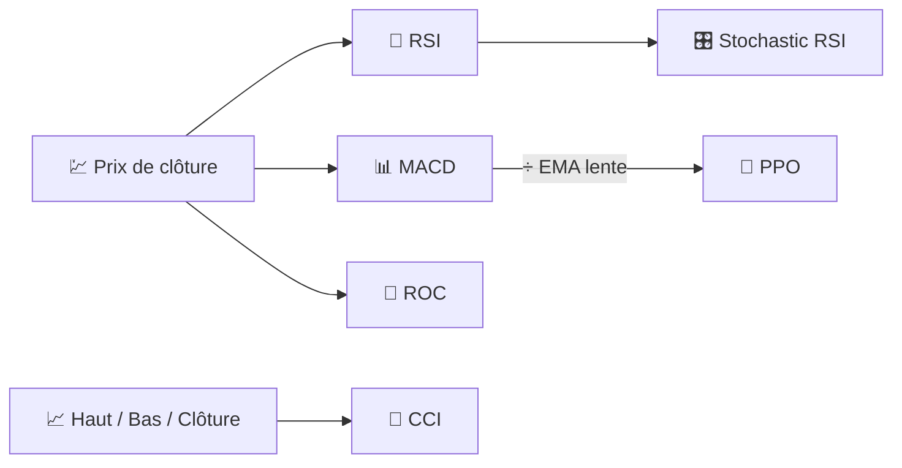

# 🚀 Indicateurs de Momentum

Les indicateurs de momentum mesurent la **vitesse et la persistance** des mouvements de prix plutôt que leur niveau. Ils répondent à la question : *"le marché pousse-t-il plus fort, ou s'essouffle-t-il ?"*

---

## 💡 Ce que mesure ce groupe

Mathématiquement, la plupart des indicateurs de momentum sont des dérivées discrètes ou des dérivées remises à l'échelle du prix (ou d'un autre oscillateur, comme dans le Stochastic RSI). Ils oscillent dans une plage bornée ou approximativement bornée, ce qui en fait des candidats naturels pour l'interprétation **surachat/survente** et l'analyse de **divergence** (le prix fait un nouveau sommet alors que le momentum non).

---

## 📋 Indicateurs dans cette catégorie

| Indicateur | Ce qu'il mesure | Utilisation clé | Détails |
|-----------|-------------------|---------|---------|
| **RSI** | Solde gains/pertes récents | Surachat/survente, retour à la moyenne | [📖](rsi.md) |
| **MACD** | Accélération de la tendance | Croisements haussiers/baissiers | [📖](macd.md) |
| **ROC** | Variation en pourcentage du prix sur $N$ jours | Momentum pur, repérage de divergences | [📖](roc.md) |
| **Stochastic RSI** | Propres extrêmes surachat/survente du RSI | Signaux de retournement plus rapides et sensibles | [📖](stochastic-rsi.md) |
| **PPO** | MACD, normalisé par le prix | Comparaison du momentum entre actifs de niveaux de prix différents | [📖](ppo.md) |
| **CCI** | Écart par rapport à une moyenne de prix typique | Points de retournement cycliques | [📖](cci.md) |

---

## 📥 Exigences de données

| Indicateur | Entrées | Remarques |
|-----------|--------|-------|
| RSI, MACD, ROC, Stochastic RSI, PPO | `close` | Oscillateurs dérivés purs du prix |
| CCI | `high`, `low`, `close` | Utilise le *prix typique* $(H+L+C)/3$ |

---

## 🔍 Tableau comparatif

| Indicateur | Période(s) par défaut | Plage de sortie | Borné ? |
|-----------|--------------------|---------------|----------|
| RSI | 14 | 0–100 | Oui |
| MACD | 12 / 26 / 9 | Non borné (unités de prix) | Non |
| ROC | 12 | Non borné (%) | Non |
| Stochastic RSI | 14 / 3 | 0–100 | Oui |
| PPO | 12 / 26 / 9 | Non borné (%) | Non |
| CCI | 14 | Non borné, référence ±100 | Non |

!!! tip "Oscillateurs bornés vs non bornés"

    Le RSI et le Stochastic RSI sont **normalisés** (toujours 0–100), donc leurs seuils sont
    universels d'un actif à l'autre. Le MACD, le ROC, le PPO et le CCI dépendent de
    **l'échelle** — le PPO existe précisément pour rendre le momentum de type MACD
    comparable entre instruments ayant des niveaux de prix très différents.

---

## 🔗 Liens associés

- 📉 **[Tous les indicateurs](index.md)** — Catalogue complet avec vues financières et traitement du signal
- 🧭 **[Indicateurs de tendance](trend.md)** — Direction et force du mouvement sous-jacent
- 📏 **[Indicateurs de volatilité](volatility.md)** — Dispersion, pas la direction
