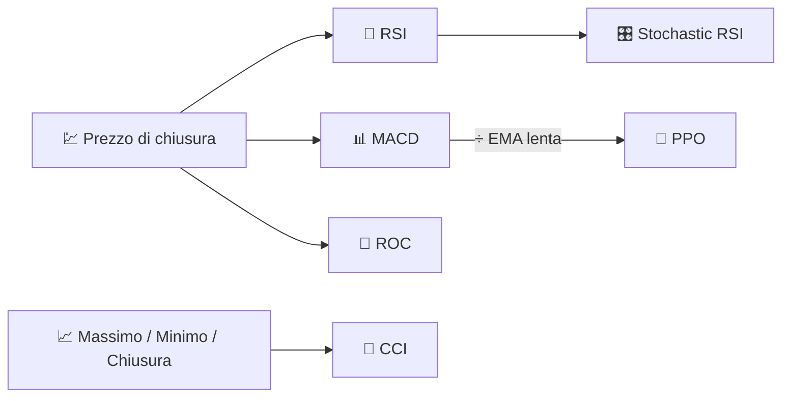

# 🚀 Indicatori di Momentum

Gli indicatori di momentum misurano la **velocità e la persistenza** dei movimenti di prezzo, non il loro livello. Rispondono alla domanda: *"il mercato sta spingendo più forte, o sta esaurendo la spinta?"*

---

## 💡 Cosa Misura Questo Gruppo

Matematicamente, la maggior parte degli indicatori di momentum sono derivate discrete o derivate riscalate del prezzo (o di un altro oscillatore, come nel caso dello Stochastic RSI). Oscillano all'interno di un intervallo limitato o approssimativamente limitato, il che li rende candidati naturali per l'interpretazione di **ipercomprato/ipervenduto** e l'analisi delle **divergenze** (il prezzo fa un nuovo massimo mentre il momentum no).

---

## 📋 Indicatori in Questa Categoria

| Indicatore | Cosa Misura | Utilizzo Principale | Dettagli |
|-----------|-------------------|---------|---------|
| **RSI** | Bilancio tra guadagni e perdite recenti | Ipercomprato/ipervenduto, ritorno alla media | [📖](rsi.md) |
| **MACD** | Accelerazione del trend | Incroci rialzisti/ribassisti | [📖](macd.md) |
| **ROC** | Variazione percentuale del prezzo su $N$ giorni | Momentum puro, individuazione di divergenze | [📖](roc.md) |
| **Stochastic RSI** | Estremi di ipercomprato/ipervenduto dell'RSI stesso | Segnali di inversione più veloci e sensibili | [📖](stochastic-rsi.md) |
| **PPO** | MACD, normalizzato per il prezzo | Confronto del momentum tra asset con livelli di prezzo diversi | [📖](ppo.md) |
| **CCI** | Deviazione dalla media del prezzo tipico | Punti di svolta ciclici | [📖](cci.md) |

---

## 📥 Requisiti dei Dati

| Indicatore | Input | Note |
|-----------|--------|-------|
| RSI, MACD, ROC, Stochastic RSI, PPO | `close` | Oscillatori puri derivativi del prezzo |
| CCI | `high`, `low`, `close` | Utilizza il *prezzo tipico* $(H+L+C)/3$ |

---

## 🔍 Tabella Comparativa

| Indicatore | Periodo(i) Predefinito(i) | Intervallo di Uscita | Limitato? |
|-----------|--------------------|---------------|----------|
| RSI | 14 | 0–100 | Sì |
| MACD | 12 / 26 / 9 | Non limitato (unità di prezzo) | No |
| ROC | 12 | Non limitato (%) | No |
| Stochastic RSI | 14 / 3 | 0–100 | Sì |
| PPO | 12 / 26 / 9 | Non limitato (%) | No |
| CCI | 14 | Non limitato, riferimento ±100 | No |

!!! tip "Oscillatori limitati vs non limitati"

    RSI e Stochastic RSI sono **normalizzati** (sempre 0–100), quindi le loro soglie sono
    universali tra diversi asset. MACD, ROC, PPO e CCI sono **dipendenti dalla scala** — il PPO esiste
    proprio per rendere il momentum simile al MACD confrontabile tra strumenti con livelli di prezzo
    molto diversi.

---

## 🔗 Correlati

- 📉 **[Tutti gli Indicatori](index.md)** — Catalogo completo con viste finanziarie e di elaborazione del segnale
- 🧭 **[Indicatori di Trend](trend.md)** — Direzione e forza del movimento sottostante
- 📏 **[Indicatori di Volatilità](volatility.md)** — Dispersione, non direzione
