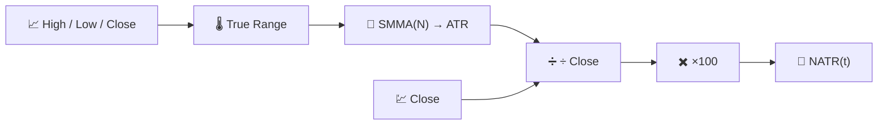

# 📐 NATR — Normalized Average True Range

NATR is [ATR](atr.md) with one division added: it expresses the same volatility measurement as a **percentage of the closing price**, making it directly comparable across instruments and across time as an asset's price level changes.

---

## 💡 Financial Meaning

An ATR of €3 is enormous for a €10 stock and negligible for a €1,000 stock. NATR removes that distortion, so a volatility screen across an entire portfolio — "which of my holdings is moving the most, relative to its own price?" — becomes meaningful. It is also more stable through time for a single asset that has undergone a stock split or a large multi-year price change.

---

## 🔢 Mathematical Formula

Building on the True Range and ATR (see [ATR](atr.md)):

$$
NATR_t = 100 \cdot \frac{ATR_t}{C_t}
$$

Because $ATR_t$ is always non-negative, $NATR_t \ge 0$, with no theoretical upper bound.

---

## ⚙️ Parameters

| Parameter | Key | Default | Description |
|---|---|---|---|
| Period ($N$) | `period` | 14 | Smoothing window applied to the underlying True Range (same as ATR). |

---

## 🎛️ Signal Processing Equivalent — Envelope Estimator with Automatic Gain Control

Where ATR is a smoothed rectified envelope of price range, NATR adds the same **Automatic Gain Control (AGC)** normalisation used by [PPO](ppo.md): dividing an absolute-magnitude measurement by the signal's own current level ($C_t$) yields a scale-free relative measurement, exactly as AGC keeps an amplifier's output level consistent regardless of the input signal's amplitude.

!!! note "Choosing ATR vs NATR"

    Use **ATR** for single-asset decisions in that asset's own price units (e.g.
    stop-loss distance in euros). Use **NATR** for cross-asset or cross-time
    comparisons, or whenever the raw price level is not directly meaningful to the
    question being asked.

:material-link: [Normalized Average True Range — TA-Lib documentation](https://ta-lib.org/function.html){ target="_blank" }
