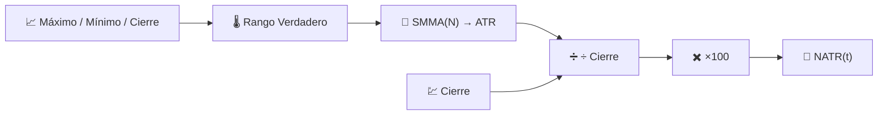

# 📐 NATR — Rango Verdadero Promedio Normalizado

NATR es [ATR](atr.md) con una división añadida: expresa la misma medición de volatilidad como un **porcentaje del precio de cierre**, haciéndola directamente comparable entre instrumentos y a través del tiempo a medida que el nivel de precio de un activo cambia.

---

## 💡 Significado Financiero

Un ATR de 3€ es enorme para una acción de 10€ e insignificante para una acción de 1.000€. NATR elimina esa distorsión, por lo que un filtro de volatilidad en una cartera completa — "¿cuál de mis posiciones se está moviendo más, en relación con su propio precio?" — se vuelve significativo. También es más estable a través del tiempo para un activo individual que ha sufrido una división de acciones o un gran cambio de precio plurianual.

---

## 🔢 Fórmula Matemática

Basándose en el Rango Verdadero y ATR (consulte [ATR](atr.md)):

$$
NATR_t = 100 \cdot \frac{ATR_t}{C_t}
$$

Debido a que $ATR_t$ siempre es no negativo, $NATR_t \ge 0$, sin límite superior teórico.

---

## ⚙️ Parámetros

| Parámetro | Clave | Por defecto | Descripción |
|---|---|---|---|
| Período ($N$) | `period` | 14 | Ventana de suavizado aplicada al Rango Verdadero subyacente (igual que ATR). |

---

## 🎛️ Equivalente de Procesamiento de Señales — Estimador de Envolvente con Control Automático de Ganancia

Donde ATR es una envolvente rectificada suavizada del rango de precios, NATR añade la misma normalización de **Control Automático de Ganancia (CAG)** utilizada por [PPO](ppo.md): dividir una medición de magnitud absoluta por el nivel actual de la señal ($C_t$) produce una medición relativa sin escala, exactamente como el CAG mantiene el nivel de salida de un amplificador consistente independientemente de la amplitud de la señal de entrada.

!!! note "Elegir ATR vs NATR"

    Utilice **ATR** para decisiones de un solo activo en las unidades de precio de ese activo (por ejemplo,
    distancia de stop-loss en euros). Utilice **NATR** para comparaciones entre activos o entre
    períodos de tiempo, o siempre que el nivel de precio bruto no sea directamente significativo para la
    pregunta que se está formulando.

:material-link: [Rango Verdadero Promedio Normalizado — Documentación de TA-Lib](https://ta-lib.org/function.html){ target="_blank" }
