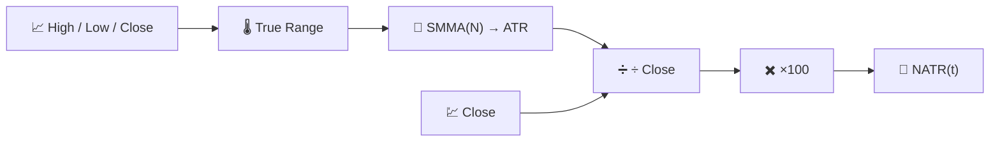

# 📐 NATR — Normalized Average True Range (Plage de variation moyenne normalisée)

Le NATR est le [ATR](atr.md) avec une division supplémentaire : il exprime la même mesure de volatilité en **pourcentage du prix de clôture**, ce qui le rend directement comparable entre instruments et dans le temps lorsque le niveau de prix d'un actif change.

---

## 💡 Signification financière

Un ATR de 3 € est énorme pour une action à 10 € et négligeable pour une action à 1 000 €. Le NATR supprime cette distorsion, de sorte qu'une couverture de volatilité sur l'ensemble d'un portefeuille — "lequel de mes positions bouge le plus, par rapport à son propre prix ?" — devient pertinent. Il est également plus stable dans le temps pour un actif unique qui a subi une division ou une variation de prix importante sur plusieurs années.

---

## 🔢 Formule mathématique

En s'appuyant sur le True Range et l'ATR (voir [ATR](atr.md)) :

$$
NATR_t = 100 \cdot \frac{ATR_t}{C_t}
$$

Comme $ATR_t$ est toujours non négatif, $NATR_t \ge 0$, sans limite théorique supérieure.

---

## ⚙️ Paramètres

| Paramètre | Clé | Défaut | Description |
|---|---|---|---|
| Période ($N$) | `period` | 14 | Fenêtre de lissage appliquée au True Range sous-jacent (identique à l'ATR). |

---

## 🎛️ Équivalent traitement du signal — Estimateur d'enveloppe avec contrôle automatique du gain

Là où l'ATR est une enveloppe rectifiée et lissée de la fourchette de prix, le NATR ajoute la même normalisation par **contrôle automatique du gain (AGC)** utilisée par le [PPO](ppo.md) : diviser une mesure de magnitude absolue par le niveau actuel du signal ($C_t$) donne une mesure relative sans échelle, exactement comme l'AGC maintient un niveau de sortie constant d'un amplificateur quelle que soit l'amplitude du signal d'entrée.

!!! note "Choisir entre ATR et NATR"

    Utilisez **l'ATR** pour les décisions sur un seul actif dans les unités de prix de cet actif (par exemple, distance de stop-loss en euros). Utilisez **le NATR** pour des comparaisons entre actifs ou dans le temps, ou chaque fois que le niveau de prix brut n'est pas directement pertinent pour la question posée.

:material-link: [Normalized Average True Range — Documentation TA-Lib](https://ta-lib.org/function.html){ target="_blank" }
