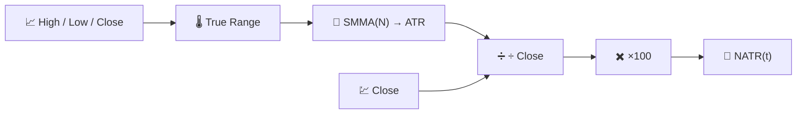

# 📐 NATR — Normalized Average True Range

NATR è [ATR](atr.md) con una divisione in più: esprime la stessa misurazione della volatilità come **percentuale del prezzo di chiusura**, rendendolo direttamente confrontabile tra strumenti e nel tempo al variare del livello di prezzo di un asset.

---

## 💡 Significato Finanziario

Un ATR di €3 è enorme per un'azione da €10 e trascurabile per un'azione da €1.000. NATR rimuove questa distorsione, quindi un confronto di volatilità su un intero portafoglio — "quale delle mie posizioni si muove di più, rispetto al proprio prezzo?" — diventa significativo. È anche più stabile nel tempo per un singolo asset che ha subito un frazionamento o una grande variazione di prezzo pluriennale.

---

## 🔢 Formula Matematica

Basandosi sul True Range e sull'ATR (vedi [ATR](atr.md)):

$$
NATR_t = 100 \cdot \frac{ATR_t}{C_t}
$$

Poiché $ATR_t$ è sempre non negativo, $NATR_t \ge 0$, senza un limite superiore teorico.

---

## ⚙️ Parametri

| Parametro | Chiave | Default | Descrizione |
|---|---|---|---|
| Periodo ($N$) | `period` | 14 | Finestra di smoothing applicata al True Range sottostante (uguale all'ATR). |

---

## 🎛️ Equivalente nell'Elaborazione dei Segnali — Stimatore d'Inviluppo con Controllo Automatico del Guadagno

Dove ATR è un inviluppo rettificato e smussato del range di prezzo, NATR aggiunge la stessa normalizzazione a **Controllo Automatico del Guadagno (AGC)** utilizzata da [PPO](ppo.md): dividere una misurazione in grandezza assoluta per il livello corrente del segnale stesso ($C_t$) produce una misurazione relativa senza scala, esattamente come l'AGC mantiene coerente il livello di uscita di un amplificatore indipendentemente dall'ampiezza del segnale in ingresso.

!!! note "Scegliere tra ATR e NATR"

    Usa **ATR** per decisioni su un singolo asset nelle unità di prezzo di quell'asset (ad es.
    distanza dello stop-loss in euro). Usa **NATR** per confronti tra asset o tra periodi
    temporali, o ogni volta che il livello di prezzo grezzo non è direttamente significativo per la
    domanda posta.

:material-link: [Normalized Average True Range — Documentazione TA-Lib](https://ta-lib.org/function.html){ target="_blank" }
