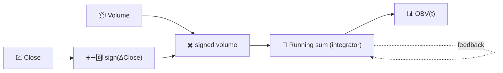

# 📊 OBV — On-Balance Volume

OBV builds a single running total that adds a day's entire volume when price closes up, and subtracts it when price closes down. It is the oldest and simplest way to fold trading activity into a directional signal.

---

## 💡 Financial Meaning

The core idea, from Joseph Granville, is that volume precedes price: smart money accumulates or distributes before the broader move becomes visible on the price chart. Traders watch for **divergence** — price drifting sideways or making lower highs while OBV keeps climbing suggests quiet accumulation and a potential upside breakout; the mirror case suggests distribution ahead of a decline. It is the slope and shape of OBV that carries the signal, not its absolute value.

---

## 🔢 Mathematical Formula

$$
OBV_t = OBV_{t-1} +
\begin{cases}
+V_t & \text{if } C_t > C_{t-1} \\
-V_t & \text{if } C_t < C_{t-1} \\
0 & \text{if } C_t = C_{t-1}
\end{cases}
$$

where $V_t$ is the traded volume at time $t$. OBV is a pure **running (cumulative) sum** — there is no window, no decay, and no smoothing constant anywhere in the formula.

---

## ⚙️ Parameters

OBV takes **no parameters**. It has no `period`, threshold, or smoothing setting to configure.

!!! note "Rebased to the chart range"

    OBV is mathematically a cumulative sum starting from the beginning of an
    asset's history, so its absolute level has no intrinsic meaning. LibreFolio
    rebases the displayed OBV series to zero at the **start of the currently
    requested chart range**, so what you read on screen is always "net signed
    volume accumulated since the left edge of the chart" — comparable regardless
    of how far back the underlying data goes.

---

## 🎛️ Signal Processing Equivalent — Signed Integrator

OBV is a discrete-time **integrator** (an accumulator, the digital equivalent of $\int V(t)\, \text{sign}(dC/dt)\, dt$) driven by a bang-bang signed input: $+V_t$, $-V_t$, or $0$. An integrator has an infinite DC gain and no cut-off frequency of its own — it never forgets, which is exactly why the *rebasing* window matters so much for interpretation.

:material-link: [On-balance volume on Wikipedia](https://en.wikipedia.org/wiki/On-balance_volume){ target="_blank" }
