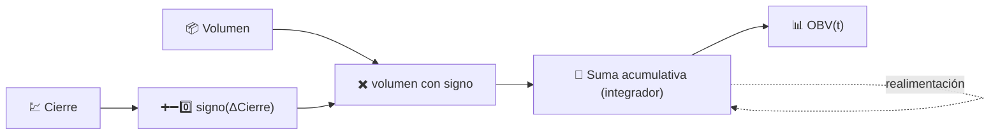

# 📊 OBV — Volumen en Balance (On-Balance Volume)

El OBV construye un único total acumulado que suma el volumen total de un día cuando el precio cierra al alza, y lo resta cuando el precio cierra a la baja. Es la forma más antigua y sencilla de incorporar la actividad de negociación en una señal direccional.

---

## 💡 Significado Financiero

La idea central, de Joseph Granville, es que el volumen precede al precio: el dinero inteligente acumula o distribuye antes de que el movimiento más amplio se vuelva visible en el gráfico de precios. Los operadores observan la **divergencia** — si el precio se mueve lateralmente o forma máximos decrecientes mientras el OBV sigue subiendo, sugiere acumulación silenciosa y una posible ruptura alcista; el caso inverso sugiere distribución antes de una caída. Es la pendiente y la forma del OBV lo que transmite la señal, no su valor absoluto.

---

## 🔢 Fórmula Matemática

$$
OBV_t = OBV_{t-1} +
\begin{cases}
+V_t & \text{si } C_t > C_{t-1} \\
-V_t & \text{si } C_t < C_{t-1} \\
0 & \text{si } C_t = C_{t-1}
\end{cases}
$$

donde $V_t$ es el volumen negociado en el momento $t$. El OBV es una **suma acumulativa** pura — no hay ventana, ni decaimiento, ni constante de suavizado en ninguna parte de la fórmula.

---

## ⚙️ Parámetros

El OBV **no requiere parámetros**. No tiene `period`, umbral ni configuración de suavizado que deba ajustarse.

!!! note "Reescalado al rango del gráfico"

    Matemáticamente, el OBV es una suma acumulativa que comienza desde el inicio
    del historial de un activo, por lo que su nivel absoluto no tiene un significado
    intrínseco. LibreFolio reescala la serie del OBV mostrada para que comience en
    cero al **inicio del rango del gráfico solicitado actualmente**, de modo que lo
    que se lee en pantalla es siempre el "volumen firmado neto acumulado desde el
    borde izquierdo del gráfico" — comparable independientemente de cuán atrás
    lleguen los datos subyacentes.

---

## 🎛️ Equivalente de Procesamiento de Señales — Integrador con Signo

El OBV es un **integrador** en tiempo discreto (un acumulador, el equivalente digital de $\int V(t)\, \text{signo}(dC/dt)\, dt$) impulsado por una entrada de signo todo-nada: $+V_t$, $-V_t$ o $0$. Un integrador tiene una ganancia de CC infinita y ninguna frecuencia de corte propia — nunca olvida, que es precisamente por qué el *reescalado* de la ventana es tan importante para la interpretación.

:material-link: [Volumen en balance en Wikipedia](https://en.wikipedia.org/wiki/On-balance_volume){ target="_blank" }
