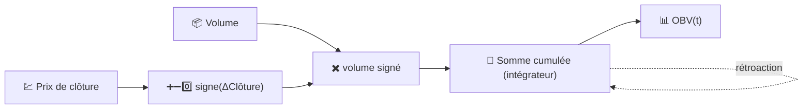

# 📊 OBV — Volume en Équilibre (On-Balance Volume)

L'OBV construit un cumul simple qui ajoute le volume total d'un jour lorsque le prix clôture en hausse, et le soustrait lorsque le prix clôture en baisse. C'est la méthode la plus ancienne et la plus simple pour intégrer l'activité de trading dans un signal directionnel.

---

## 💡 Signification Financière

L'idée centrale, de Joseph Granville, est que le volume précède le prix : l'argent intelligent s'accumule ou se distribue avant que le mouvement général ne devienne visible sur le graphique des prix. Les traders surveillent les **divergences** — un prix qui évolue latéralement ou forme des plus hauts moins élevés tandis que l'OBV continue de grimper suggère une accumulation discrète et une possible cassure à la hausse ; le cas inverse suggère une distribution avant un déclin. C'est la pente et la forme de l'OBV qui portent le signal, et non sa valeur absolue.

---

## 🔢 Formule Mathématique

$$
OBV_t = OBV_{t-1} +
\begin{cases}
+V_t & \text{si } C_t > C_{t-1} \\
-V_t & \text{si } C_t < C_{t-1} \\
0 & \text{si } C_t = C_{t-1}
\end{cases}
$$

où $V_t$ est le volume échangé au moment $t$. L'OBV est une pure **somme cumulée (cumulative sum)** — il n'y a ni fenêtre, ni décroissance, ni constante de lissage dans la formule.

---

## ⚙️ Paramètres

L'OBV ne prend **aucun paramètre**. Il n'a pas de `période`, de seuil ou de réglage de lissage à configurer.

!!! note "Rebasé sur la plage du graphique"

    L'OBV est mathématiquement une somme cumulée démarrant au début de
    l'historique d'un actif, donc son niveau absolu n'a pas de signification
    intrinsèque. LibreFolio rebase la série OBV affichée à zéro au **début de la
    plage de graphique demandée**, de sorte que ce que vous lisez à l'écran est
    toujours le "volume net signé accumulé depuis le bord gauche du graphique" —
    comparable indépendamment de la profondeur historique des données sous-jacentes.

---

## 🎛️ Équivalent en Traitement du Signal — Intégrateur Signé

L'OBV est un **intégrateur** en temps discret (un accumulateur, l'équivalent numérique de $\int V(t)\, \text{signe}(dC/dt)\, dt$) piloté par une entrée signée de type bang-bang : $+V_t$, $-V_t$, ou $0$. Un intégrateur a un gain DC infini et aucune fréquence de coupure propre — il n'oublie jamais, ce qui explique précisément pourquoi la fenêtre de *rebasage* est si importante pour l'interprétation.

:material-link: [Volume en équilibre sur Wikipédia](https://en.wikipedia.org/wiki/On-balance_volume){ target="_blank" }
