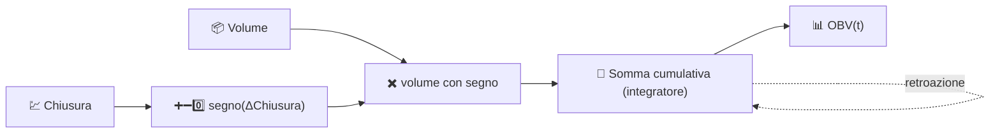

# 📊 OBV — Volume di Bilancio

L'OBV costruisce un singolo totale cumulativo che aggiunge l'intero volume giornaliero quando il prezzo di chiusura sale, e lo sottrae quando scende. È il metodo più antico e semplice per trasformare l'attività di scambio in un segnale direzionale.

---

## 💡 Significato Finanziario

L'idea centrale, proposta da Joseph Granville, è che il volume precede il prezzo: il capitale intelligente si accumula o distribuisce prima che il movimento più ampio diventi visibile sul grafico dei prezzi. I trader osservano la **divergenza** — un prezzo che si muove lateralmente o forma massimi decrescenti mentre l'OBV continua a salire suggerisce un accumulo silenzioso e un potenziale breakout al rialzo; il caso opposto suggerisce distribuzione in vista di un declino. Sono la pendenza e la forma dell'OBV a portare il segnale, non il suo valore assoluto.

---

## 🔢 Formula Matematica

$$
OBV_t = OBV_{t-1} +
\begin{cases}
+V_t & \text{se } C_t > C_{t-1} \\
-V_t & \text{se } C_t < C_{t-1} \\
0 & \text{se } C_t = C_{t-1}
\end{cases}
$$

dove $V_t$ è il volume scambiato al tempo $t$. L'OBV è una pura **somma progressiva cumulativa** — non ci sono finestre, decadimenti o costanti di livellamento nella formula.

---

## ⚙️ Parametri

L'OBV **non richiede parametri**. Non ha alcun `period`, soglia o impostazione di livellamento da configurare.

!!! note "Ribasato all'intervallo del grafico"

    L'OBV è matematicamente una somma cumulativa che parte dall'inizio della
    storia di un asset, quindi il suo livello assoluto non ha significato intrinseco.
    LibreFolio ribasa la serie OBV visualizzata a zero all'**inizio dell'intervallo
    del grafico attualmente richiesto**, quindi ciò che leggi a schermo è sempre
    "volume netto con segno accumulato dal bordo sinistro del grafico" —
    confrontabile indipendentemente da quanto indietro arrivino i dati sottostanti.

---

## 🎛️ Equivalente in Elaborazione dei Segnali — Integratore con Segno

L'OBV è un **integratore** a tempo discreto (un accumulatore, l'equivalente digitale di $\int V(t)\, \text{segno}(dC/dt)\, dt$) guidato da un ingresso binario con segno: $+V_t$, $-V_t$ o $0$. Un integratore ha un guadagno DC infinito e nessuna frequenza di taglio propria — non dimentica mai, ed è esattamente per questo che la finestra di *ribasamento* è così importante per l'interpretazione.

:material-link: [On-balance volume su Wikipedia](https://en.wikipedia.org/wiki/On-balance_volume){ target="_blank" }
