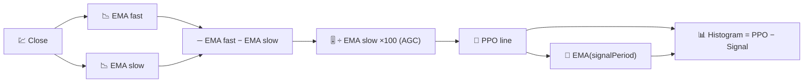

# 📐 PPO — Percentage Price Oscillator

PPO is MACD's twin, with one change that matters a lot in practice: it expresses momentum as a **percentage** of price instead of raw price units, making it directly comparable across assets of any price level.

---

## 💡 Financial Meaning

A €2 MACD reading means something very different for a €10 stock than for a €500 stock. PPO removes that ambiguity: a PPO of 2% is 2% regardless of the instrument's price, so screening a whole portfolio for "which assets have the strongest momentum right now" becomes meaningful with PPO in a way it is not with raw MACD.

---

## 🔢 Mathematical Formulas

1.  **PPO Line** — the same fast/slow EMA spread as MACD, but divided by the slow EMA and rescaled to a percentage:

    $$
    PPO_t = 100 \cdot \frac{EMA_{fast}(C_t) - EMA_{slow}(C_t)}{EMA_{slow}(C_t)}
    $$

2.  **Signal Line** — an EMA smoothing of the PPO line itself:

    $$
    Signal_t = EMA_{signal}(PPO_t)
    $$

3.  **Histogram** — the momentum-of-momentum:

    $$
    Histogram_t = PPO_t - Signal_t
    $$

---

## ⚙️ Parameters

| Parameter | Key | Default | Description |
|---|---|---|---|
| Fast Period | `fastPeriod` | 12 | Short-term EMA window (days). |
| Slow Period | `slowPeriod` | 26 | Long-term EMA window (days), also the PPO's normalising denominator. |
| Signal Period | `signalPeriod` | 9 | EMA smoothing applied to the PPO line. |

---

## 🎛️ Signal Processing Equivalent — Gain-Normalised Band-Pass Filter

MACD's band-pass output (see [MACD](macd.md)) has an amplitude that scales with the input's absolute level. PPO divides that same band-pass output by a low-pass estimate of the signal's own level ($EMA_{slow}$) — this is exactly **Automatic Gain Control (AGC)**, a standard technique in signal processing for keeping a filter's output amplitude comparable regardless of the input's DC level.

!!! info "Same crossovers, different scale"

    Every crossover rule that applies to MACD (line crosses signal, histogram flips
    sign) applies identically to PPO — only the units change, from price to percent.
    Use PPO instead of MACD whenever comparing momentum *across* different
    instruments; use MACD when working on a single instrument in its native units.

:material-link: [Percentage Price Oscillator on StockCharts](https://school.stockcharts.com/doku.php?id=technical_indicators:price_oscillators_ppo){ target="_blank" }
