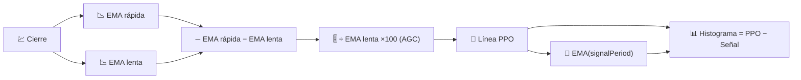

# 📐 PPO — Oscilador de Porcentaje de Precio

PPO es el gemelo del MACD, con un cambio que importa mucho en la práctica: expresa el impulso como un **porcentaje** del precio en lugar de unidades de precio brutas, lo que lo hace directamente comparable entre activos de cualquier nivel de precio.

---

## 💡 Significado Financiero

Una lectura MACD de €2 significa algo muy diferente para una acción de €10 que para una de €500. PPO elimina esa ambigüedad: un PPO del 2% es 2% independientemente del precio del instrumento, por lo que evaluar una cartera completa para "qué activos tienen el impulso más fuerte ahora mismo" se vuelve significativo con PPO de una manera que no lo es con MACD bruto.

---

## 🔢 Fórmulas Matemáticas

1. **Línea PPO** — la misma diferencia de EMA rápida/lenta que MACD, pero dividida por la EMA lenta y reescalada a un porcentaje:

    $$
    PPO_t = 100 \cdot \frac{EMA_{rápida}(C_t) - EMA_{lenta}(C_t)}{EMA_{lenta}(C_t)}
    $$

2. **Línea de Señal** — un suavizado EMA de la propia línea PPO:

    $$
    Señal_t = EMA_{señal}(PPO_t)
    $$

3. **Histograma** — el impulso del impulso:

    $$
    Histograma_t = PPO_t - Señal_t
    $$

---

## ⚙️ Parámetros

| Parámetro | Clave | Valor por Defecto | Descripción |
|---|---|---|---|
| Período Rápido | `fastPeriod` | 12 | Ventana EMA a corto plazo (días). |
| Período Lento | `slowPeriod` | 26 | Ventana EMA a largo plazo (días), también el denominador normalizador del PPO. |
| Período de Señal | `signalPeriod` | 9 | Suavizado EMA aplicado a la línea PPO. |

---

## 🎛️ Equivalente de Procesamiento de Señales — Filtro Paso Banda Normalizado por Ganancia

La salida de paso banda de MACD (ver [MACD](macd.md)) tiene una amplitud que escala con el nivel absoluto de la entrada. PPO divide esa misma salida de paso banda por una estimación de paso bajo del propio nivel de la señal ($EMA_{lenta}$) — esto es exactamente **Control Automático de Ganancia (AGC)**, una técnica estándar en procesamiento de señales para mantener la amplitud de salida de un filtro comparable independientemente del nivel DC de la entrada.

!!! info "Mismos cruces, escala diferente"

    Cada regla de cruce que se aplica a MACD (la línea cruza la señal, el histograma cambia
    de signo) se aplica idénticamente a PPO — solo cambian las unidades, de precio a porcentaje.
    Use PPO en lugar de MACD siempre que compare el impulso *entre* diferentes
    instrumentos; use MACD cuando trabaje con un solo instrumento en sus unidades nativas.

:material-link: [Oscilador de Porcentaje de Precio en StockCharts](https://school.stockcharts.com/doku.php?id=technical_indicators:price_oscillators_ppo){ target="_blank" }
