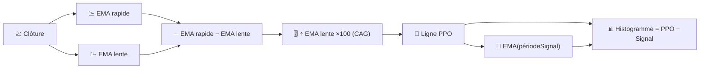

# 📐 PPO — Oscillateur de Prix en Pourcentage

Le PPO est le jumeau du MACD, avec une modification qui compte beaucoup en pratique : il exprime le momentum en **pourcentage** du prix plutôt qu'en unités de prix brutes, ce qui le rend directement comparable entre des actifs de niveaux de prix différents.

---

## 💡 Signification Financière

Une lecture MACD de 2 € signifie quelque chose de très différent pour une action à 10 € que pour une action à 500 €. Le PPO élimine cette ambiguïté : un PPO de 2 % est 2 %, quel que soit le prix de l'instrument, donc analyser un portefeuille entier pour trouver « quels actifs ont le momentum le plus fort en ce moment » devient pertinent avec le PPO d'une manière qui ne l'est pas avec le MACD brut.

---

## 🔢 Formules Mathématiques

1. **Ligne PPO** — le même écart EMA rapide/lente que le MACD, mais divisé par l'EMA lente et remis à l'échelle en pourcentage :

    $$
    PPO_t = 100 \cdot \frac{EMA_{rapide}(C_t) - EMA_{lente}(C_t)}{EMA_{lente}(C_t)}
    $$

2. **Ligne de Signal** — un lissage EMA de la ligne PPO elle-même :

    $$
    Signal_t = EMA_{signal}(PPO_t)
    $$

3. **Histogramme** — le momentum du momentum :

    $$
    Histogramme_t = PPO_t - Signal_t
    $$

---

## ⚙️ Paramètres

| Paramètre | Clé | Défaut | Description |
|---|---|---|---|
| Période Rapide | `fastPeriod` | 12 | Fenêtre EMA à court terme (jours). |
| Période Lente | `slowPeriod` | 26 | Fenêtre EMA à long terme (jours), également le dénominateur de normalisation du PPO. |
| Période de Signal | `signalPeriod` | 9 | Lissage EMA appliqué à la ligne PPO. |

---

## 🎛️ Équivalent en Traitement du Signal — Filtre Passe-Bande à Gain Normalisé

La sortie passe-bande du MACD (voir [MACD](macd.md)) a une amplitude qui évolue avec le niveau absolu de l'entrée. Le PPO divise cette même sortie passe-bande par une estimation passe-bas du niveau propre du signal ($EMA_{lente}$) — c'est exactement le **Contrôle Automatique de Gain (CAG)** , une technique standard en traitement du signal pour maintenir la comparabilité de l'amplitude de sortie d'un filtre, quel que soit le niveau continu de l'entrée.

!!! info "Mêmes croisements, échelle différente"

    Toute règle de croisement qui s'applique au MACD (la ligne croise le signal,
    l'histogramme change de signe) s'applique de manière identique au PPO —
    seules les unités changent, du prix au pourcentage.
    Utilisez le PPO plutôt que le MACD lorsque vous comparez le momentum *entre*
    différents instruments ; utilisez le MACD lorsque vous travaillez sur un seul
    instrument dans ses unités natives.

:material-link: [Oscillateur de Prix en Pourcentage sur StockCharts](https://school.stockcharts.com/doku.php?id=technical_indicators:price_oscillators_ppo){ target="_blank" }
