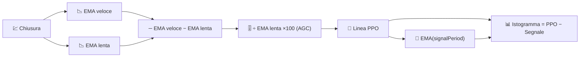

# 📐 PPO — Oscillatore percentuale del prezzo

Il PPO è il gemello del MACD, con un cambiamento che conta molto nella pratica: esprime lo slancio come **percentuale** del prezzo invece che in unità di prezzo grezze, rendendolo direttamente confrontabile tra asset con livelli di prezzo diversi.

---

## 💡 Significato Finanziario

Una lettura MACD di €2 significa qualcosa di molto diverso per un'azione da €10 rispetto a una da €500. Il PPO rimuove questa ambiguità: un PPO del 2% è il 2% indipendentemente dal prezzo dello strumento, quindi analizzare un intero portafoglio per "quali asset hanno lo slancio più forte in questo momento" diventa significativo con il PPO in un modo che non lo è con il MACD grezzo.

---

## 🔢 Formule Matematiche

1. **Linea PPO** — la stessa differenza EMA veloce/lenta del MACD, ma divisa per l'EMA lenta e riscalata in percentuale:

    $$
    PPO_t = 100 \cdot \frac{EMA_{veloce}(C_t) - EMA_{lenta}(C_t)}{EMA_{lenta}(C_t)}
    $$

2. **Linea Segnale** — un livellamento EMA della linea PPO stessa:

    $$
    segnale_t = EMA_{segnale}(PPO_t)
    $$

3. **Istogramma** — il momentum del momentum:

    $$
    Istogramma_t = PPO_t - segnale_t
    $$

---

## ⚙️ Parametri

| Parametro | Chiave | Predefinito | Descrizione |
|---|---|---|---|
| Periodo Veloce | `fastPeriod` | 12 | Finestra EMA a breve termine (giorni). |
| Periodo Lento | `slowPeriod` | 26 | Finestra EMA a lungo termine (giorni), anche denominatore di normalizzazione del PPO. |
| Periodo Segnale | `signalPeriod` | 9 | Livellamento EMA applicato alla linea PPO. |

---

## 🎛️ Equivalente nell'elaborazione del segnale — Filtro passa-banda a guadagno normalizzato

L'uscita passa-banda del MACD (vedi [MACD](macd.md)) ha un'ampiezza che scala con il livello assoluto dell'ingresso. Il PPO divide la stessa uscita passa-banda per una stima passa-basso del livello del segnale stesso ($EMA_{lenta}$) — questo è esattamente il **Controllo Automatico del Guadagno (AGC)**, una tecnica standard nell'elaborazione del segnale per mantenere l'ampiezza dell'uscita di un filtro confrontabile indipendentemente dal livello DC dell'ingresso.

!!! info "Stessi incroci, scala diversa"

    Ogni regola di incrocio che si applica al MACD (la linea incrocia il segnale,
    l'istogramma cambia segno) si applica allo stesso modo al PPO — cambiano solo
    le unità, da prezzo a percentuale. Usa il PPO invece del MACD ogni volta che
    confronti lo slancio *tra* strumenti diversi; usa il MACD quando lavori su un
    singolo strumento nelle sue unità native.

:material-link: [Percentage Price Oscillator su StockCharts](https://school.stockcharts.com/doku.php?id=technical_indicators:price_oscillators_ppo){ target="_blank" }
