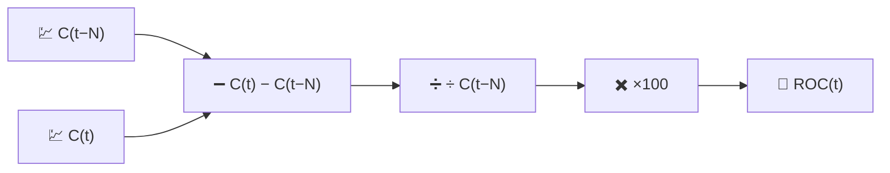

# 🚀 ROC — Rate of Change

ROC is the most direct momentum measurement possible: the percentage change of price over the last $N$ periods, with nothing else layered on top.

---

## 💡 Financial Meaning

If ROC is positive and rising, price is not just going up — it is going up *faster* than $N$ periods ago. Traders watch for zero-line crosses (a shift from momentum loss to momentum gain, or vice versa) and for **divergences**: price makes a new high while ROC makes a lower high, warning that the advance is losing steam even though the price chart still looks strong.

---

## 🔢 Mathematical Formula

$$
ROC_t(N) = 100 \cdot \frac{C_t - C_{t-N}}{C_{t-N}}
$$

This is simply a percentage $N$-period return, re-expressed as a running indicator rather than a one-off calculation.

---

## ⚙️ Parameters

| Parameter | Key | Default | Description |
|---|---|---|---|
| Period ($N$) | `period` | 12 | Number of days back used as the reference price. |

---

## 🎛️ Signal Processing Equivalent — Normalised Finite-Difference Derivative

ROC is a **discrete derivative** of $\log$-free price, taken over a fixed lag of $N$ samples rather than a single sample, and normalised by the base value:

$$
ROC_t \approx N \cdot \frac{\Delta C}{\Delta t}\bigg/ C_{t-N} \times 100
$$

Unlike MACD (which subtracts two *low-pass* outputs to approximate a smoothed derivative), ROC is a **raw, unsmoothed** finite difference — it inherits all the high-frequency noise of the price series, amplified rather than filtered.

!!! warning "Noise amplification"

    Because ROC applies no smoothing, short periods ($N \le 5$) produce a very jagged
    series. It is often used with a longer $N$, or fed through an additional moving
    average, when a cleaner momentum reading is needed.

:material-link: [Rate of change (technology) on Wikipedia](https://en.wikipedia.org/wiki/Momentum_(technical_analysis)){ target="_blank" }
