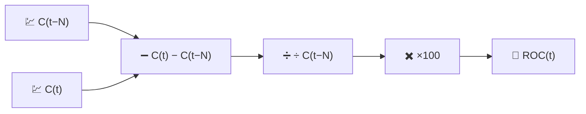

# 🚀 ROC — Tasa de Cambio

ROC es la medición de impulso más directa posible: el cambio porcentual del precio durante los últimos $N$ períodos, sin nada más superpuesto.

---

## 💡 Significado Financiero

Si el ROC es positivo y está aumentando, el precio no solo está subiendo — está subiendo *más rápido* que hace $N$ períodos. Los traders observan los cruces de la línea cero (un cambio de pérdida de impulso a ganancia de impulso, o viceversa) y las **divergencias**: el precio hace un nuevo máximo mientras el ROC hace un máximo más bajo, advirtiendo que el avance está perdiendo fuerza aunque el gráfico de precios aún se vea fuerte.

---

## 🔢 Fórmula Matemática

$$
ROC_t(N) = 100 \cdot \frac{C_t - C_{t-N}}{C_{t-N}}
$$

Esto es simplemente un rendimiento porcentual de $N$ períodos, reexpresado como un indicador continuo en lugar de un cálculo único.

---

## ⚙️ Parámetros

| Parámetro | Clave | Predeterminado | Descripción |
|---|---|---|---|
| Período ($N$) | `period` | 12 | Número de días hacia atrás utilizado como precio de referencia. |

---

## 🎛️ Equivalente de Procesamiento de Señales — Derivada de Diferencia Finita Normalizada

El ROC es una **derivada discreta** del precio sin $\log$, calculada sobre un retraso fijo de $N$ muestras en lugar de una sola muestra, y normalizada con respecto al valor base:

$$
ROC_t \approx N \cdot \frac{\Delta C}{\Delta t}\bigg/ C_{t-N} \times 100
$$

A diferencia de MACD (que resta dos salidas de *pase bajo* para aproximar una derivada suavizada), ROC es una diferencia finita **cruda y sin suavizar** — hereda todo el ruido de alta frecuencia de la serie de precios, amplificado en lugar de filtrado.

!!! warning "Amplificación de ruido"

    Debido a que ROC no aplica suavizado, los períodos cortos ($N \le 5$) producen una serie
    muy irregular. A menudo se utiliza con un $N$ más largo, o se pasa a través de un promedio
    móvil adicional, cuando se necesita una lectura de impulso más limpia.

:material-link: [Rate of change (technology) on Wikipedia](https://en.wikipedia.org/wiki/Momentum_(technical_analysis)){ target="_blank" }