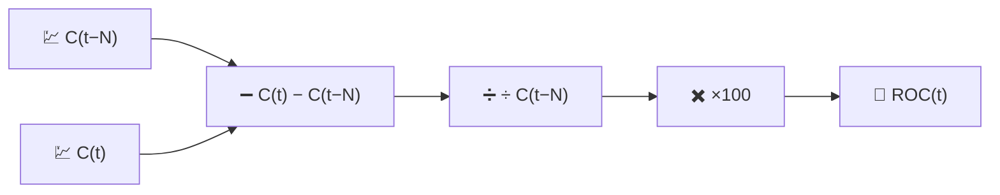

# 🚀 ROC — Taux de Variation

Le ROC est la mesure de momentum la plus directe possible : le pourcentage de variation du prix sur les $N$ dernières périodes, sans rien d'autre ajouté par-dessus.

---

## 💡 Signification financière

Si le ROC est positif et en hausse, le prix ne fait pas que monter — il monte *plus vite* qu'il y a $N$ périodes. Les traders surveillent les croisements de la ligne zéro (passage d'une perte de momentum à un gain de momentum, ou vice versa) et les **divergences** : le prix atteint un nouveau sommet tandis que le ROC forme un sommet moins élevé, avertissant que la hausse perd de son momentum même si le graphique des prix semble encore solide.

---

## 🔢 Formule mathématique

$$
ROC_t(N) = 100 \cdot \frac{C_t - C_{t-N}}{C_{t-N}}
$$

Il s'agit simplement d'un rendement en pourcentage sur $N$ périodes, réexprimé sous forme d'indicateur continu plutôt qu'un calcul ponctuel.

---

## ⚙️ Paramètres

| Paramètre | Clé | Défaut | Description |
|---|---|---|---|
| Période ($N$) | `period` | 12 | Nombre de jours en arrière utilisé comme prix de référence. |

---

## 🎛️ Équivalent en traitement du signal — Dérivée normalisée par différence finie

Le ROC est une **dérivée discrète** du prix sans $\log$, calculée sur un retard fixe de $N$ échantillons au lieu d'un seul échantillon, et normalisée par rapport à la valeur de référence :

$$
ROC_t \approx N \cdot \frac{\Delta C}{\Delta t}\bigg/ C_{t-N} \times 100
$$

Contrairement au MACD (qui soustrait deux sorties *passe-bas* pour approcher une dérivée lissée), le ROC est une différence finie **brute, non lissée** — il hérite de tout le bruit haute fréquence de la série de prix, amplifié plutôt que filtré.

!!! warning "Amplification du bruit"

    Comme le ROC n'applique aucun lissage, les périodes courtes ($N \le 5$) produisent une série très irrégulière.
    Il est souvent utilisé avec un $N$ plus long, ou passé à travers une moyenne mobile supplémentaire,
    lorsqu'une lecture de momentum plus propre est nécessaire.

:material-link: [Taux de variation (analyse technique) sur Wikipédia](https://en.wikipedia.org/wiki/Momentum_(technical_analysis)){ target="_blank" }