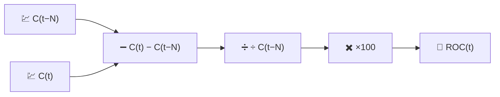

# 🚀 ROC — Tasso di Variazione

Il ROC è la misura del momentum più diretta possibile: la variazione percentuale del prezzo negli ultimi $N$ periodi, senza alcun altro elemento sovrapposto.

---

## 💡 Significato Finanziario

Se il ROC è positivo e in aumento, il prezzo non sta solo salendo — sta salendo *più velocemente* rispetto a $N$ periodi fa. I trader osservano gli attraversamenti della linea dello zero (un passaggio da perdita di momentum a guadagno di momentum, o viceversa) e le **divergenze**: il prezzo forma un nuovo massimo mentre il ROC forma un massimo inferiore, segnalando che il rialzo sta perdendo slancio anche se il grafico dei prezzi sembra ancora forte.

---

## 🔢 Formula Matematica

$$
ROC_t(N) = 100 \cdot \frac{C_t - C_{t-N}}{C_{t-N}}
$$

Questo è semplicemente un rendimento percentuale su $N$ periodi, riespresso come indicatore a finestra mobile piuttosto che come calcolo puntuale.

---

## ⚙️ Parametri

| Parametro | Chiave | Default | Descrizione |
|---|---|---|---|
| Periodo ($N$) | `period` | 12 | Numero di giorni indietro usato come prezzo di riferimento. |

---

## 🎛️ Equivalente nell'Elaborazione dei Segnali — Derivata Normalizzata a Differenze Finite

Il ROC è una **derivata discreta** del prezzo senza $\log$, calcolata su un ritardo fisso di $N$ campioni anziché su un singolo campione, e normalizzata rispetto al valore di base:

$$
ROC_t \approx N \cdot \frac{\Delta C}{\Delta t}\bigg/ C_{t-N} \times 100
$$

A differenza del MACD (che sottrae due output *passa-basso* per approssimare una derivata smussata), il ROC è una **differenza finita grezza e non smussata** — eredita tutto il rumore ad alta frequenza della serie dei prezzi, amplificato anziché filtrato.

!!! warning "Amplificazione del rumore"

    Poiché il ROC non applica alcuna smussatura, periodi brevi ($N \le 5$) producono
    una serie molto frastagliata. Viene spesso utilizzato con un $N$ più lungo, o
    fatto passare attraverso una media mobile aggiuntiva, quando è necessaria una
    lettura del momentum più pulita.

:material-link: [Tasso di variazione (tecnologia) su Wikipedia](https://en.wikipedia.org/wiki/Momentum_(technical_analysis)){ target="_blank" }
