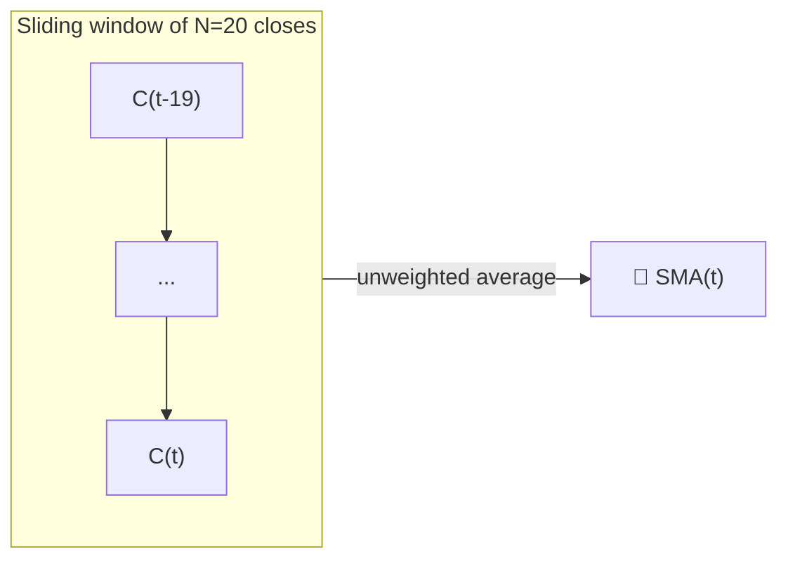

# 📏 SMA — Simple Moving Average

The SMA is the most literal way to define a "trend": the unweighted average of the last $N$ closing prices. Every EMA, Bollinger Band and Donchian midline in this catalogue builds on the same rectangular-window idea.

---

## 💡 Financial Meaning

Because every observation in the window counts equally, the SMA reacts to new data more slowly than an EMA of the same length, but it also has **zero phase distortion** relative to its window — it is not "biased" toward recent or old prices. Traders use SMA crossovers (e.g. 50/200-day "golden cross") as the textbook long-horizon trend signal.

---

## 🔢 Mathematical Formula

$$
SMA_{t}(N) = \frac{1}{N} \sum_{i=0}^{N-1} C_{t-i}
$$

where $C_t$ is the closing price at time $t$. Equivalently, as a running update:

$$
SMA_t = SMA_{t-1} + \frac{C_t - C_{t-N}}{N}
$$

which shows the SMA is a **finite-memory** filter: the oldest sample is dropped exactly as the newest one enters.

---

## ⚙️ Parameters

| Parameter | Key | Default | Description |
|---|---|---|---|
| Period ($N$) | `period` | 20 | Lookback window in days. Higher → smoother, slower. |

---

## 🎛️ Signal Processing Equivalent — Rectangular FIR Filter

The SMA is a **Finite Impulse Response (FIR)** low-pass filter with a rectangular (boxcar) window of length $N$. Its frequency response is a $\operatorname{sinc}$ function, with the first null at $\omega = 2\pi/N$ — frequencies above that are attenuated, but with significant sidelobes (ripple) that let some high-frequency noise leak through, unlike a well-tuned IIR design.

!!! tip "Group delay"

    A rectangular FIR filter of length $N$ has a constant **group delay** of
    $(N-1)/2$ samples — exactly the "lag" traders complain about. This is the price
    paid for the SMA's perfectly flat, unbiased weighting.

:material-link: [Moving average on Wikipedia](https://en.wikipedia.org/wiki/Moving_average){ target="_blank" }
