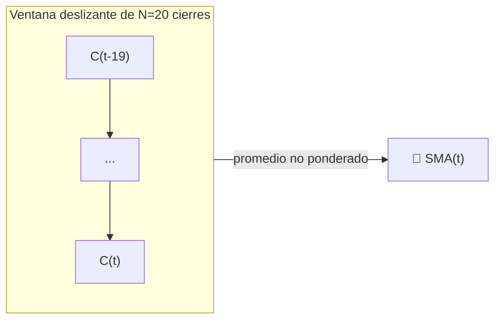

# 📏 SMA — Media Móvil Simple

La SMA es la forma más literal de definir una "tendencia": el promedio no ponderado de los últimos $N$ precios de cierre. Cada EMA, Banda de Bollinger y línea media de Donchian en este catálogo se basa en la misma idea de ventana rectangular.

---

## 💡 Significado Financiero

Debido a que cada observación en la ventana cuenta por igual, la SMA reacciona a nuevos datos más lentamente que una EMA de la misma longitud, pero también tiene **distorsión de fase cero** con respecto a su ventana — no está "sesgada" hacia precios recientes o antiguos. Los operadores utilizan los cruces de SMA (por ejemplo, el "cruce dorado" de 50/200 días) como la señal de tendencia de largo plazo por excelencia.

---

## 🔢 Fórmula Matemática

$$
SMA_{t}(N) = \frac{1}{N} \sum_{i=0}^{N-1} C_{t-i}
$$

donde $C_t$ es el precio de cierre en el tiempo $t$. De manera equivalente, como una actualización recursiva:

$$
SMA_t = SMA_{t-1} + \frac{C_t - C_{t-N}}{N}
$$

lo que muestra que la SMA es un filtro de **memoria finita**: la muestra más antigua se descarta exactamente cuando entra la más nueva.

---

## ⚙️ Parámetros

| Parámetro | Clave | Valor por defecto | Descripción |
|---|---|---|---|
| Período ($N$) | `period` | 20 | Ventana retrospectiva en días. Cuanto mayor → más suave, más lento. |

---

## 🎛️ Equivalente en Procesamiento de Señales — Filtro FIR Rectangular

La SMA es un filtro de paso bajo de **Respuesta al Impulso Finita (FIR)** con una ventana rectangular (boxcar) de longitud $N$. Su respuesta en frecuencia es una función $\operatorname{sinc}$, con el primer nulo en $\omega = 2\pi/N$ — las frecuencias por encima se atenúan, pero con lóbulos secundarios (rizado) significativos que permiten que algo de ruido de alta frecuencia se filtre, a diferencia de un diseño IIR bien ajustado.

!!! tip "Retardo de grupo"

    Un filtro FIR rectangular de longitud $N$ tiene un **retardo de grupo** constante de
    $(N-1)/2$ muestras — exactamente el "rezago" del que se quejan los operadores. Este es el precio
    que se paga por la ponderación perfectamente plana e imparcial de la SMA.

:material-link: [Media móvil en Wikipedia](https://en.wikipedia.org/wiki/Moving_average){ target="_blank" }
