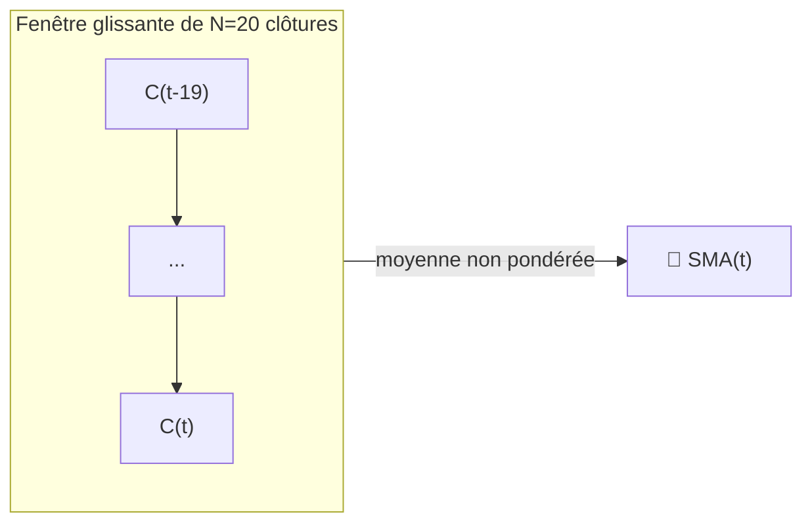

# 📏 SMA — Moyenne Mobile Simple

La SMA est la manière la plus littérale de définir une « tendance » : la moyenne non pondérée des $N$ derniers cours de clôture. Chaque EMA, chaque bande de Bollinger et chaque ligne médiane de Donchian de ce catalogue repose sur la même idée de fenêtre rectangulaire.

---

## 💡 Signification financière

Comme chaque observation dans la fenêtre compte de manière égale, la SMA réagit aux nouvelles données plus lentement qu'une EMA de même longueur, mais elle présente également un **déphasage nul** par rapport à sa fenêtre — elle n'est « biaisée » ni vers les cours récents ni vers les cours anciens. Les traders utilisent les croisements de SMA (ex. le « croisement doré » 50/200 jours) comme le signal de tendance long terme de référence.

---

## 🔢 Formule mathématique

$$
SMA_{t}(N) = \frac{1}{N} \sum_{i=0}^{N-1} C_{t-i}
$$

où $C_t$ est le cours de clôture au moment $t$. De manière équivalente, sous forme de mise à jour récursive :

$$
SMA_t = SMA_{t-1} + \frac{C_t - C_{t-N}}{N}
$$

ce qui montre que la SMA est un filtre à **mémoire finie** : l'échantillon le plus ancien est abandonné exactement au moment où le plus récent entre.

---

## ⚙️ Paramètres

| Paramètre | Clé | Défaut | Description |
|---|---|---|---|
| Période ($N$) | `period` | 20 | Fenêtre de rétrospection en jours. Plus élevé → plus lisse, plus lent. |

---

## 🎛️ Équivalent en traitement du signal — Filtre FIR rectangulaire

La SMA est un filtre passe-bas à **réponse impulsionnelle finie (FIR)** avec une fenêtre rectangulaire (boxcar) de longueur $N$. Sa réponse en fréquence est une fonction $\operatorname{sinc}$, avec le premier zéro à $\omega = 2\pi/N$ — les fréquences supérieures sont atténuées, mais avec des lobes secondaires (ondulations) significatifs qui laissent passer une partie du bruit haute fréquence, contrairement à une conception IIR bien réglée.

!!! tip "Retard de groupe"

    Un filtre FIR rectangulaire de longueur $N$ a un **retard de groupe** constant
    de $(N-1)/2$ échantillons — exactement le « décalage » dont les traders se plaignent. C'est le prix
    à payer pour la pondération parfaitement plate et non biaisée de la SMA.

:material-link: [Moyenne mobile sur Wikipédia](https://en.wikipedia.org/wiki/Moving_average){ target="_blank" }
