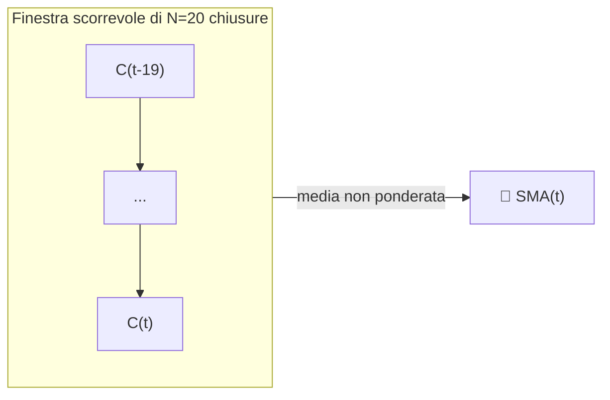

# 📏 SMA — Media Mobile Semplice

La SMA è il modo più letterale per definire un "trend": la media non ponderata degli ultimi $N$ prezzi di chiusura. Ogni EMA, Banda di Bollinger e linea mediana di Donchian in questo catalogo si basa sulla stessa idea di finestra rettangolare.

---

## 💡 Significato Finanziario

Poiché ogni osservazione nella finestra conta allo stesso modo, la SMA reagisce ai nuovi dati più lentamente di un'EMA della stessa lunghezza, ma ha anche **distorsione di fase zero** rispetto alla sua finestra — non è "sbilanciata" verso i prezzi recenti o passati. I trader utilizzano gli incroci delle SMA (ad esempio il "golden cross" 50/200 giorni) come segnale di trend di lungo periodo da manuale.

---

## 🔢 Formula Matematica

$$
SMA_{t}(N) = \frac{1}{N} \sum_{i=0}^{N-1} C_{t-i}
$$

dove $C_t$ è il prezzo di chiusura al tempo $t$. Equivalentemente, come aggiornamento ricorsivo:

$$
SMA_t = SMA_{t-1} + \frac{C_t - C_{t-N}}{N}
$$

che mostra come la SMA sia un filtro a **memoria finita**: il campione più vecchio viene eliminato esattamente quando entra quello più nuovo.

---

## ⚙️ Parametri

| Parametro | Chiave | Default | Descrizione |
|---|---|---|---|
| Periodo ($N$) | `period` | 20 | Finestra di osservazione in giorni. Più alto → più liscio, più lento. |

---

## 🎛️ Equivalente nell'Elaborazione dei Segnali — Filtro FIR Rettangolare

La SMA è un filtro **Finite Impulse Response (FIR)** passa-basso con una finestra rettangolare (boxcar) di lunghezza $N$. La sua risposta in frequenza è una funzione $\operatorname{sinc}$, con il primo nullo a $\omega = 2\pi/N$ — le frequenze superiori vengono attenuate, ma con lobi laterali significativi (ondulazione) che consentono la fuoriuscita di parte del rumore ad alta frequenza, a differenza di un progetto IIR ben sintonizzato.

!!! tip "Ritardo di gruppo"

    Un filtro FIR rettangolare di lunghezza $N$ ha un **ritardo di gruppo** costante
    di $(N-1)/2$ campioni — esattamente il ritardo di cui si lamentano i trader. Questo è il prezzo
    pagato per la ponderazione perfettamente piatta e non distorta della SMA.

:material-link: [Media mobile su Wikipedia](https://en.wikipedia.org/wiki/Moving_average){ target="_blank" }
